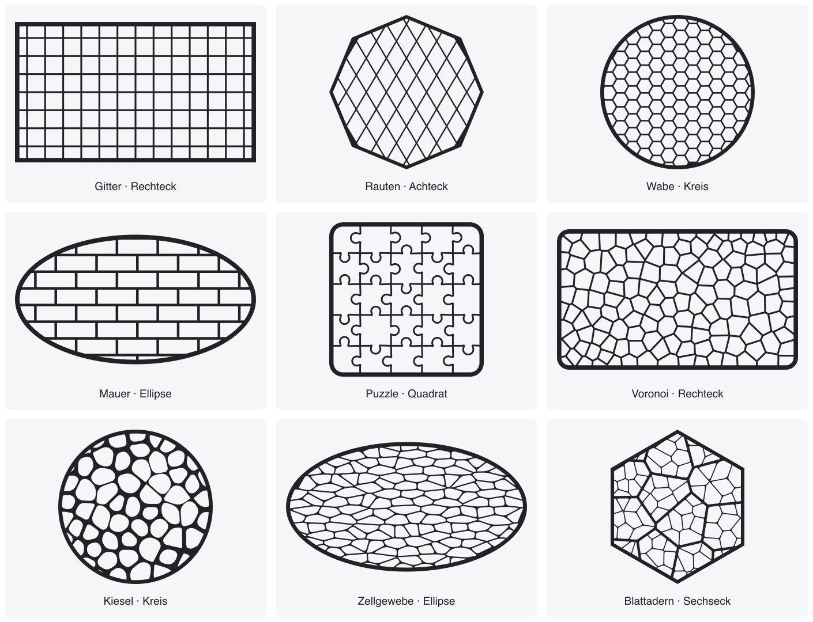
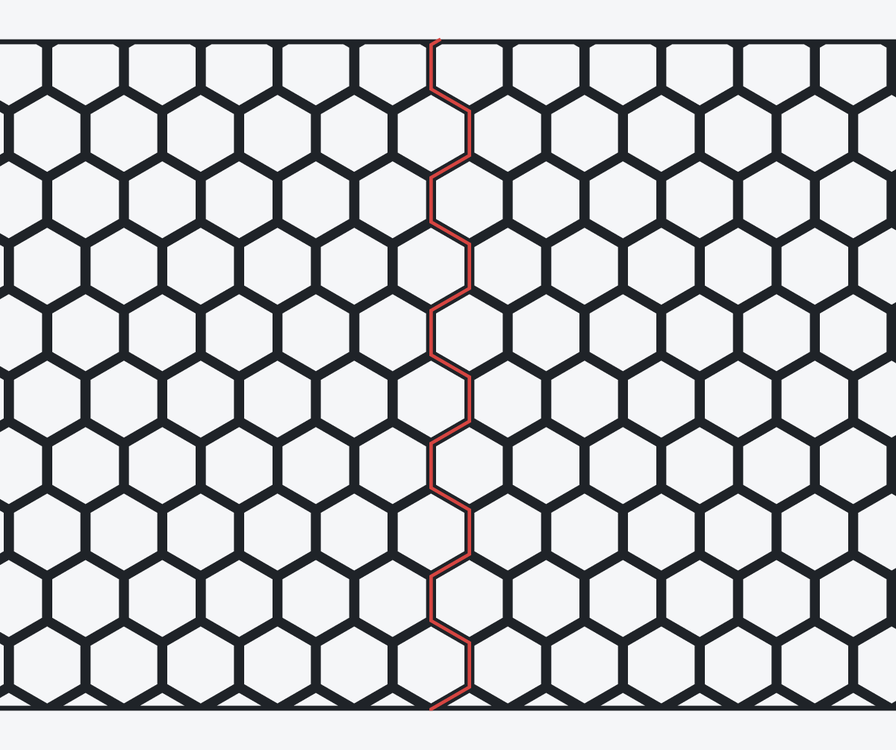
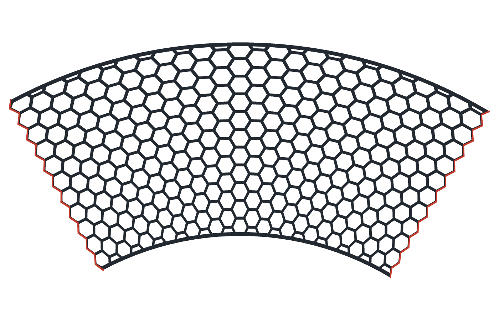

# PatternCreator

*🇬🇧 [English version below](#english) — the same documentation in English.*

Fusion-360-Add-In für **parametrische 2D-Muster** in Skizzen: technische Raster
(Gitter, Rauten, Wabe, Mauer, Puzzle) und organische Zellmuster (Voronoi, Kiesel,
Zellgewebe, Blattadern). Bedient wird alles über ein eigenes Editor-Fenster mit
**Live-Vorschau**. Jedes Muster ist **extrudierbar** und **nachträglich bearbeitbar**.

Zusätzlich lässt sich in jedes Muster eine **Text-Ebene** einbetten, die das Muster
optional ausstanzt („Knockout“), damit der Text lesbar bleibt.

Als Rahmen dient wahlweise eine Grundform, die Kontur einer eigenen Skizze – oder
die **Mantelfläche eines Zylinders**: dann läuft das Muster rundum, ohne sichtbare
Naht, und kann auf Wunsch gleich auf die Fläche geprägt werden.

**Inhalt:** [Galerie](#galerie) · [Installation](#installation) · [Erste Schritte](#erste-schritte-in-5-minuten) ·
[Bedienung](#bedienung) · [Grundbegriffe](#grundbegriffe) ·
[Parameter-Referenz](#parameter-referenz) · [Fehlerbehebung](#fehlerbehebung) ·
[Tests](#tests) · [Architektur](#architektur) ·
[Einschränkungen](#bekannte-einschränkungen)

---

## Galerie

Alle neun Muster, jedes in einer anderen Rahmenform. Die Bilder sind vom Add-In
selbst erzeugt (Flächenmodus, Füllung „Stege“, gezeichneter Rahmen, Seed 7) – es
ist exakt die Geometrie, die auch als Skizze in Fusion landet.



Einzelbilder in voller Auflösung und die Einstellungen dazu:

| Muster | Rahmenform | Einstellungen | Bild |
| --- | --- | --- | --- |
| Gitter (`grid`) | Rechteck 120 × 70 mm | Abstand 9 × 9 mm, Steg 0,9 mm | [01](docs/images/01-gitter-rechteck.png) |
| Rauten (`rhombus`) | Achteck ⌀ 100 mm | Raute 13 × 22 mm, Steg 0,9 mm | [02](docs/images/02-rauten-vieleck.png) |
| Wabe (`honeycomb`) | Kreis ⌀ 100 mm | Zelle 9 mm, flach, Steg 1,0 mm | [03](docs/images/03-wabe-kreis.png) |
| Mauer (`brick`) | Ellipse 130 × 70 mm | Ziegel 22 × 9 mm, Fuge 1,4 mm, Läuferverband, Steg 0,6 mm | [04](docs/images/04-mauer-ellipse.png) |
| Puzzle (`puzzle`) | Quadrat 90 mm, Ecken R 8 mm | 5 × 5 Teile, Nase 28 %, Hals 18 % | [05](docs/images/05-puzzle-quadrat.png) |
| Voronoi (`voronoi`) | Rechteck 120 × 70 mm, Ecken R 6 mm | 140 Zellen, Relax 2, Steg 0,9 mm | [06](docs/images/06-voronoi-rechteck.png) |
| Kiesel (`pebbles`) | Kreis ⌀ 100 mm | 70 Zellen, Rundung 3, Fuge 0,2 mm, Streuung 25 % | [07](docs/images/07-kiesel-kreis.png) |
| Zellgewebe (`tissue`) | Ellipse 130 × 70 mm | 180 Zellen, 8 Reihen, Anisotropie 2,5 | [08](docs/images/08-zellgewebe-ellipse.png) |
| Blattadern (`leaf_veins`) | Sechseck ⌀ 110 mm | 13 grobe / 9 feine Zellen, Adernverhältnis 2,6 | [09](docs/images/09-blattadern-sechseck.png) |

Die Rahmenform ist frei kombinierbar: jedes Muster lässt sich in jede der fünf
Formen (Rechteck, Quadrat, Kreis, Ellipse, Vieleck) einpassen.

**Auf dem Zylinder** läuft das Muster rundum. Das Bild zeigt die Abwicklung an
der Stelle, an der sie sich schließt – zweimal derselbe Umlauf nebeneinander.
Die rote Linie ist die **Naht**: sie folgt den Zellwänden, statt gerade
durchzuschneiden, und deshalb ist am Bauteil keine zu sehen.



**Auf dem Kegel** ist die Abwicklung kein Rechteck, sondern ein
**Kreisringsektor** – der Abstand zur Spitze bleibt erhalten, der Winkel wird
gestaucht. Die beiden roten Kanten sind dieselbe Naht: nach dem Wickeln liegen
sie aufeinander. Zur Spitze hin (oben) werden die Zellen schmaler, weil dort
weniger Umfang für dieselbe Zellzahl da ist.



---

## Installation

### Voraussetzungen

* **Autodesk Fusion 360** (macOS oder Windows) – das Add-In nutzt ausschließlich die
  mitgelieferte Python-Umgebung.
* **Keine externen Pakete.** Weder Python-Bibliotheken (kein numpy/scipy/shapely) noch
  JavaScript-Bibliotheken. Es gibt keinen Build-Schritt, und alles läuft offline.

### Schritt 1 – Dateien besorgen

```bash
git clone https://github.com/Soccertrash/PatternCreator.git
```

Alternativ das ZIP-Archiv herunterladen und entpacken. Der Ordner muss anschließend
mindestens diese Dateien enthalten:

```
PatternCreator/
├── PatternCreator.manifest     ← muss neben ...
├── PatternCreator.py           ← ... dieser Datei liegen
├── commands/  core/  generators/  text/  fusion/  palette/  resources/
```

> **Wichtig:** Der Ordner muss `PatternCreator` heißen – exakt so wie
> `PatternCreator.py` und `PatternCreator.manifest`. Heißt er anders (z. B.
> `PatternCreator-main` nach einem ZIP-Download), findet Fusion das Add-In nicht.
> In dem Fall den Ordner umbenennen.

### Schritt 2 – In den Add-Ins-Ordner kopieren

**Am einfachsten: `install.sh`** (macOS, Linux, Windows mit Git Bash)

```bash
./install.sh
```

Das Skript prüft zuerst, ob Fusion läuft (dann kann das Add-In geladen sein und wird
nicht überschrieben), löscht eine vorhandene Installation vollständig, kopiert die
Dateien frisch hinüber – ohne `.git`, `.venv` und Caches – und prüft am Ende, dass die
erwartete Version im Ziel angekommen ist.

| Option | Wirkung |
| --- | --- |
| `--dry-run` | zeigt nur, was passieren würde |
| `--force` | installiert auch bei laufendem Fusion |
| `--dir PFAD` | abweichender AddIns-Ordner |

Läuft Fusion noch, bricht das Skript mit Anleitung ab (Beenden im Dialog *Skripte und
Add-Ins*, dann Fusion schließen). Ein Ordner, der kein `PatternCreator.manifest`
enthält, wird nie gelöscht – Schutz vor einem falsch gesetzten `--dir`.

**Oder von Hand — macOS**

```bash
cp -R PatternCreator ~/Library/Application\ Support/Autodesk/Autodesk\ Fusion\ 360/API/AddIns/
```

Zielpfad im Finder: `Gehe zu → Gehe zum Ordner …` (`⇧⌘G`) und
`~/Library/Application Support/Autodesk/Autodesk Fusion 360/API/AddIns` eingeben.

**Windows**

```bat
xcopy /E /I PatternCreator "%APPDATA%\Autodesk\Autodesk Fusion 360\API\AddIns\PatternCreator"
```

Zielpfad im Explorer: `%APPDATA%\Autodesk\Autodesk Fusion 360\API\AddIns` in die
Adresszeile eingeben.

> Existiert der Ordner `AddIns` noch nicht, einfach anlegen.

### Schritt 3 – Add-In in Fusion starten

Ohne diesen Schritt gibt es **keine** Buttons in der Oberfläche – im Manifest steht
`runOnStartup: false`, Fusion lädt das Add-In also nicht von allein.

1. Fusion 360 starten (oder neu starten, falls es beim Kopieren schon lief).
2. Reiter **Dienstprogramme → ADD-INS → Skripte und Add-Ins …** (`⇧S`) –
   englische Oberfläche: **UTILITIES → ADD-INS → Scripts and Add-Ins …**
3. Registerkarte **Add-Ins** (nicht *Skripte*) → in der Liste **PatternCreator**
   markieren.
4. **Ausführen** klicken (englisch: **Run**).

Die beiden Buttons **„Muster erstellen“** und **„Muster bearbeiten“** erscheinen
danach im Reiter **Volumenkörper**, Gruppe **Erstellen** – englische Oberfläche:
Reiter **SOLID**, Gruppe **CREATE**. Sie stehen **ganz unten**; sind sie in der
Icon-Reihe nicht zu sehen, auf **Erstellen ▾** / **CREATE ▾** klicken – dort sind
sie die letzten Einträge der Klappliste.

> Die Beschriftung der Buttons bleibt deutsch, auch bei englischer
> Fusion-Oberfläche.

### Schritt 4 (optional) – Automatisch mit Fusion starten

Im selben Dialog bei markiertem PatternCreator **„Beim Start ausführen“**
(englisch: **Run on Startup**) aktivieren.
Wer es lieber manuell hält, lässt die Option aus – dann muss nach jedem Fusion-Start
einmal **Ausführen** geklickt werden.

### Aktualisieren

1. In **Skripte und Add-Ins** auf **Beenden** klicken (oder Fusion schließen).
2. Den Ordner im `AddIns`-Verzeichnis durch die neue Version ersetzen.
3. **Ausführen** klicken.

Ob die neue Fassung wirklich geladen ist, zeigt der Dialog *Skripte und Add-Ins*:
das Add-In markieren – rechts steht die **Version** aus dem Manifest (aktuell 1.7.0).

Fusion cacht die HTML-Oberfläche der Palette. Das Add-In hängt deshalb automatisch
eine Version an die URL an; sollte der Editor trotzdem in einem alten Stand hängen,
hilft ein Neustart von Fusion.

### Deinstallation

**Beenden** in *Skripte und Add-Ins* klicken und den Ordner `PatternCreator` aus dem
`AddIns`-Verzeichnis löschen. Bereits erzeugte Skizzen bleiben erhalten – sie sind
ganz normale Fusion-Geometrie. Nur das nachträgliche Bearbeiten ist ohne das Add-In
nicht mehr möglich.

---

## Erste Schritte in 5 Minuten

Ziel: ein Untersetzer mit Wabenmuster – als Beispiel für den kompletten Ablauf.

0. **Läuft das Add-In schon?** Falls nicht, zuerst
   [Schritt 3 der Installation](#schritt-3--add-in-in-fusion-starten) ausführen –
   sonst gibt es die Buttons nicht.
1. **Neues Konstruktionsdokument** anlegen.
2. **Volumenkörper → Erstellen → Muster erstellen** klicken (englische Oberfläche:
   **SOLID → CREATE → Muster erstellen**, ganz unten in der Klappliste **CREATE ▾**).
3. Im Dialog die Skizzenebene wählen (oder leer lassen für die XY-Ursprungsebene) und
   **OK** klicken. Der **Muster-Editor** öffnet sich rechts als andockbare Palette.
4. Oben im Dropdown **Wabe** wählen. Die Vorschau zeigt das Muster sofort.
5. Gruppe **Rahmen** aufklappen → Form **Kreis**, Durchmesser **90 mm**.
6. Gruppe **Muster-Parameter** → Vorgabe **Mittel**, Zellweite z. B. **10 mm**.
7. Gruppe **Stil** → Modus **Flächen**, Füllung **Stege**, Dicke **1,2 mm**,
   Beschnitt **Am Rand beschneiden**, **Rahmen zeichnen** an.
8. Optional Gruppe **Text-Ebene** → aktivieren, Text eingeben. Mit aktivem
   **Muster ausstanzen** bleibt der Text frei von Waben. Die Position lässt sich
   direkt in der Vorschau mit der Maus ziehen.
9. **In Skizze erzeugen** klicken. Fusion legt die Skizze an und zeichnet das Muster –
   als **ein** Timeline-Schritt.
10. Die fertige Skizze in Fusion wie gewohnt weiterverwenden, z. B. mit **Extrudieren**
    (Taste **E**) die Profile auswählen und auf Tiefe bringen.
11. Etwas ändern? **Muster bearbeiten** klicken, die Skizze wählen, Werte anpassen,
    erneut erzeugen. Eine darauf aufgebaute Extrusion rechnet automatisch neu.

---

## Bedienung

### Der Editor

```
┌──────────────────────────────────────┐
│ [Piktogramm] Wabe            ▾   [?] │  Mustertyp + Kurzhilfe
│ Seed 42   🎲 Würfeln    Ebene: XY    │
├──────────────────────────────────────┤
│                                      │
│          Live-Vorschau               │  Zoom = Mausrad, Verschieben = Ziehen
│          (Canvas)                    │  Text = direkt verschiebbar
│  382 Konturen · 382 Flächen · …      │  ⤢ = einpassen
├──────────────────────────────────────┤
│ ▾ Muster-Parameter  [fein|mittel|…]  │
│ ▸ Rahmen                             │
│ ▸ Stil                               │
│ ▸ Text-Ebene                         │
├──────────────────────────────────────┤
│ Zurücksetzen ↶ ↷   Abbrechen  [Erz.] │
└──────────────────────────────────────┘
```

*(Screenshot-Platzhalter – bitte beim ersten Lauf ersetzen.)*

### Schritt für Schritt

1. **Muster wählen** – Dropdown oben, gruppiert in *Technisch* und
   *Organische Zellen*, jeweils mit Piktogramm. Das **?** daneben blendet eine
   Kurzbeschreibung mit allen Parametern ein.
2. **Parameter einstellen** – die Formulare entstehen automatisch aus dem jeweiligen
   Muster. Schieberegler und Zahlenfelder sind auf den erlaubten Bereich begrenzt;
   die Vorschau aktualisiert sich 150 ms nach der letzten Änderung.
   Über **Fein / Mittel / Grob** gibt es je Muster fertige Vorgaben.
3. **Rahmen** – Form (Rechteck, Quadrat, Kreis, Ellipse, Vieleck oder **Eigener
   Rahmen**), Maße, Ursprung, Drehung des Rahmens und – davon unabhängig – Drehung
   des Musters im Rahmen. Zum eigenen Rahmen siehe den nächsten Abschnitt.
4. **Stil** – *Linien* für Gravuren, *Flächen* für extrudierbare Profile. Im
   Flächenmodus bestimmt **Dicke** die Stegbreite; **Füllung** schaltet zwischen
   *Stegen* (Wände zwischen den Zellen) und *Zellen* (die Zellflächen selbst) um.
   Muster ohne Zellstruktur bieten nur *Stege* an – die Auswahl wird dann ausgeblendet.
   **Rahmendicke** legt die Breite des geschlossenen Randes fest; sie wird **nach
   innen** gemessen, das eingestellte Rahmenmaß bleibt also das Außenmaß.
5. **Text-Ebene** – ein- oder mehrzeiliger Text mit Schriftart, Höhe, Position und
   Winkel. **Muster ausstanzen** hält den Textbereich (plus einstellbaren Rand) frei.
6. **Seed** – jedes Zufallsmuster hängt allein am Seed. Gleicher Seed ⇒ identisches
   Ergebnis in Vorschau, Skizze und nach dem Bearbeiten. **Würfeln** probiert Varianten.
7. **In Skizze erzeugen** – erzeugt die Skizze und speichert alle Werte als Attribut
   an der Skizze. Danach wechselt der Button auf **Skizze aktualisieren**, weitere
   Änderungen bauen dieselbe Skizze neu auf.
8. **Abbrechen** schließt den Editor, ohne irgendetwas im Dokument zu hinterlassen.

Das Add-In erzeugt ausschließlich Skizzen. Zum Volumenkörper wird das Muster mit
Fusions eigenem **Extrudieren** – so bleibt die volle Kontrolle über Tiefe,
Richtung und Vorgang bei dir.

### Eigener Rahmen

Statt einer der fünf Grundformen kann die **Außenkontur eines geschlossenen
Skizzenprofils oder einer ebenen Fläche** der Rahmen sein – also jede Form, die
sich in Fusion zeichnen lässt, auch stark konkave. Es gibt zwei Wege dorthin:

**Weg 1 – beim Erstellen.** Im Dialog **Muster erstellen** ist die Auswahl
„Ebene, Fläche oder Profil". Wird eine Fläche oder ein Profil gewählt, erscheint
das Kontrollkästchen **Kontur als Rahmen verwenden** (standardmäßig an). Nach
*OK* öffnet der Editor mit dieser Kontur als Rahmen, und die Skizze entsteht
später auf derselben Ebene bzw. auf der Fläche.

**Weg 2 – im Editor.** In der Gruppe *Rahmen* die Form **Eigener Rahmen** wählen.
Darunter erscheinen eine Infozeile und zwei Knöpfe:

* **Aus Fusion-Auswahl übernehmen** – liest, was gerade im Fusion-Canvas
  ausgewählt ist (ein geschlossenes Profil oder eine ebene Fläche).
* **Rahmen neu einlesen** – liest die gespeicherte Quelle erneut, zum Beispiel
  nachdem die Rahmen-Skizze in Fusion geändert wurde.

Die Infozeile nennt Quelle, Punktzahl und Maße:
`Quelle: Skizze1 / Profil · 213 Punkte · 54,2 × 31,0 mm`.

Was dabei zu wissen ist:

* Der Rahmen ist ein **Schnappschuss**. Die Kontur steht als Punktliste im
  Dokument; ein Re-Edit funktioniert auch dann noch, wenn die Quell-Skizze
  gelöscht oder verschoben wurde. Nachziehen lässt sich das jederzeit mit
  *Rahmen neu einlesen*.
* Nur die **Außenkontur** zählt. Löcher im Profil oder Bohrungen in der Fläche
  bleiben unberücksichtigt.
* **Bögen werden zu Linienzügen** (Toleranz 0,02 mm) – dieselbe Toleranz, mit
  der auch der Elemente-Optimierer arbeitet.
* Alles andere funktioniert wie in den Grundformen: Muster, Stil, Schraffur,
  Text, Flächenmodell, Rahmendicke, Beschnitt und Re-Edit.
* Ist der Rahmen an einer Stelle schmaler als zweimal die **Rahmendicke**, lässt
  sich das Maß dort nicht einhalten. Das Muster entsteht trotzdem, die Vorschau
  warnt aber ausdrücklich – still danebenliegen soll das Ergebnis nicht.
* **Zurücksetzen** in der Gruppe *Rahmen* wirft die eingelesene Kontur weg.

### Muster auf Zylinder und Kegel

Ein Muster kann auch auf eine **Mantelfläche** gelegt werden – rundum, ohne
sichtbare Naht. Der Editor zeigt dabei die **Abwicklung**: das Muster, wie es
aussähe, wenn man den Zylinder aufschneidet und flach ausrollt. Fusion wickelt es
beim Erzeugen wieder auf die Fläche.

**So geht es:** Im Dialog **Muster erstellen** eine zylindrische oder konische
Fläche wählen (oder im Editor *Fläche aus Auswahl übernehmen*). Der Rahmen ist
dann die Abwicklung – Breite = Umfang, Höhe = Länge der Fläche –, und die
Rahmenmaße verschwinden aus dem Formular. Nach *In Skizze erzeugen* entstehen
eine Tangentialebene, die Skizze darauf und – wenn **Auf die Fläche prägen**
angehakt ist – die Prägung.

Was dabei zu wissen ist:

* **Die Naht ist keine Gerade.** Ein gerader Schnitt würde bei versetzten Mustern
  (Wabe, Rauten, Mauer im Verband) in jeder zweiten Reihe eine Zelle zerteilen.
  Stattdessen sucht sich der Schnitt einen Weg **entlang der Zellwände**; die
  linke und die rechte Kante der Abwicklung sind dieselbe Bahn, um genau einen
  Umlauf versetzt. Nach dem Wickeln liegen sie aufeinander und die Naht ist eine
  gewöhnliche Zellwand.
* **Die Zellgröße rastet.** Sie wird auf den nächstgelegenen Teiler des Umfangs
  gerundet – sichtbar als ein paar Prozent Abweichung, unsichtbar bleibt dafür
  die Naht.
* **Der Nahtwinkel** dreht das Muster um die Achse und legt damit fest, wo die
  Naht auf dem Bauteil sitzt.
* **Ursprung, Drehung und Musterdrehung entfallen.** Die Lage setzt Fusion
  selbst; ein gedrehtes Gitter wäre nach einem Umlauf nicht mehr fortsetzbar.
* **Prägen** braucht das Flächenmodell (Modus *Flächen*, Füllung *Stege*,
  *Rahmen zeichnen* an). Positive Tiefe stellt das Muster von der Fläche ab,
  negative senkt es ein. Rundum entstehen dabei **zwei** Prägungen: ein Profil
  über volle 360° lehnt Fusion als sich selbst durchdringenden Körper ab. Die
  Trennlinie zwischen beiden läuft in der Mitte eines Stegs und ist am Teil
  nicht zu sehen.
* **Teilflächen** (Halbzylinder, ausgeschnittene Stücke) gehen ebenfalls – dort
  ist der Rahmen die abgewickelte Kontur und läuft ein Rahmenband rundum.
* **Beschnitt *Aus* gibt es hier nicht.** Ohne Beschnitt reicht das Muster über
  den Umlauf hinaus und läge nach dem Wickeln auf sich selbst; auf einer
  Mantelfläche wird deshalb immer am Rand beschnitten. Das Feld verschwindet aus
  dem Formular.
* **Die Fläche ist ein Schnappschuss**, genau wie der eigene Rahmen: Maße,
  Öffnungswinkel und ein Verweis auf die Fläche stehen im Muster, nicht die
  Fläche selbst. Änderst du den Körper später, rechnet das Muster weiter mit den
  alten Maßen und sagt es beim nächsten Erzeugen – *Fläche aus Auswahl
  übernehmen* liest sie neu ein.
* **Kegel** wickeln sich als **Kreisringsektor** ab, nicht als Rechteck – der
  Abstand zur Spitze bleibt erhalten, der Winkel wird gestaucht. Der Editor
  zeigt diesen Sektor, und in der Flächenzeile steht, wie weit er reicht
  („Sektor 71°"). Zwei Folgen davon:
  * **Zum spitzen Ende hin werden die Zellen schmaler.** Das ist unvermeidlich:
    ein Muster, das rundum passt, hat auf jedem Höhenkreis gleich viele Zellen,
    und der Umfang nimmt zur Spitze hin ab. Die Stege gehen mit – wird es dort
    eng, sagt eine Warnung, wie schmal sie werden.
  * **Text wird nur gedreht und verschoben, nicht gebogen.** Fusions
    Skizzentext lässt sich nicht krümmen; bei großen Buchstaben ist das zu
    sehen.

**Die Naht nachmessen.** Am Bauteil ist die Naht nicht zu finden – das ist ja
der Zweck. Nachmessen lässt sie sich trotzdem, und zwar in der **flachen
Skizze**, wo sie am linken und rechten Rand liegt:

1. Muster erzeugen. Im Browser den Körper ausblenden, sodass nur noch die
   Skizze „Muster …" zu sehen ist.
2. Ganz an den **linken Rand** des Musters zoomen. Die Kante dort läuft im
   Zickzack an den Zellwänden entlang – das ist die eine Hälfte der Naht.
3. **Dienstprogramme → PRÜFEN → Messen**. Die Randkante anklicken und dann die
   Kante des Lochs daneben.
4. Erwartet wird die **halbe** eingestellte Stegdicke: 0,40 mm bei 0,8 mm
   Stegdicke. Am rechten Rand dasselbe – die beiden Hälften ergeben nach dem
   Wickeln einen ganzen Steg.

Zur Kontrolle: oben und unten misst man an derselben Stelle die volle
**Rahmendicke** (1,00 mm bei Standardwerten), denn dort läuft das Rahmenband und
nicht die Naht.

Wer die Naht am fertigen Teil *sehen* will: sie liegt der Berührlinie der
Tangentialebene genau gegenüber. Die Ebene heißt im Browser „PatternCreator
Tangente" – einblenden, auf die andere Seite des Zylinders drehen, dort sitzt
sie. Wenn man sie auch dann nicht erkennt, hat sie ihre Aufgabe erfüllt.

### Vorhandenes Muster bearbeiten

**Volumenkörper → Erstellen → Muster bearbeiten** (englisch: **SOLID → CREATE**)
öffnet eine Liste aller
Muster-Skizzen des Dokuments; alternativ die Skizze direkt im Modell anklicken
(nur PatternCreator-Skizzen sind wählbar). Der Editor startet mit exakt den
gespeicherten Werten. Beim erneuten Erzeugen wird **dieselbe** Skizze neu aufgebaut –
eine darauf aufgebaute Extrusion rechnet neu, statt zu verwaisen.

Wurde die Skizze zwischendurch von Hand verändert, warnt das Add-In vor dem
Überschreiben und lässt sich abbrechen.

### Tastenkürzel

| Kürzel | Wirkung |
| --- | --- |
| `Strg`/`Cmd` + `Z` | Rückgängig im Editor (bis zu 100 Schritte) |
| `Strg`/`Cmd` + `Umschalt` + `Z`, `Strg`/`Cmd` + `Y` | Wiederholen |
| `Strg`/`Cmd` + `R` | Neuen Seed würfeln |
| `Strg`/`Cmd` + `Enter` | In Skizze erzeugen |
| Mausrad über der Vorschau | Zoomen |
| Ziehen in der Vorschau | Verschieben – auf dem Text: Text verschieben |

### Einheiten

Der Editor zeigt **Millimeter**, das Datenmodell rechnet in **Zentimetern**
(interne Längeneinheit der Fusion-API). Umgerechnet wird ausschließlich an der
Grenze Editor ↔ Dokument: eine Eingabe von `10 mm` steht als `1.0` im PatternDoc.

### Typische Anwendungen

| Ziel | Einstellungen |
| --- | --- |
| Wabenplatte zum Extrudieren | Wabe · Flächen · Stege · Dicke 1–2 mm · Beschnitt *cut* |
| Gitterrost / Lüftungsgitter | Gitter oder Rauten · Flächen · Stege · Rahmen an |
| Gravur / Lasergravur | beliebiges Muster · **Linien** · Rahmen aus |
| Puzzle zum Lasercut | Puzzle · Linien (Schnittlinien) oder Flächen (einzelne Teile) |
| Natürlich wirkender Rand | Beschnitt **Angeschnittene weglassen** |
| Beschriftetes Muster-Panel | Text-Ebene an · Muster ausstanzen an · Flächen |
| Deko-Fliese mit organischer Optik | Kiesel · Rundheit 3 · Flächen · Stege |

---

## Grundbegriffe

| Begriff | Bedeutung |
| --- | --- |
| **Rahmen (Container)** | Rechteck (optional mit Eckenradius), Quadrat, Kreis, Ellipse oder Vieleck (3–12 Seiten), in das das Muster eingepasst wird. |
| **Eigener Rahmen** | Außenkontur eines geschlossenen Skizzenprofils oder einer ebenen Fläche als Rahmen – auch konkav. Wird als Punktliste ins Dokument übernommen (Schnappschuss), nicht als Verknüpfung. |
| **Linienmodus** | Es entstehen reine Kurven – für Gravuren und dekorative Skizzen. |
| **Flächenmodus** | Jede Kurve wird über die **Dicke** zu einem geschlossenen Streifen, jede Zelle zu einem geschlossenen Polygon → direkt extrudierbar. |
| **Stege / Zellen** | Im Flächenmodus wahlweise die Wände *zwischen* den Zellen oder die Zellflächen selbst. |
| **Beschnitt** | `Am Rand beschneiden` (cut), `Angeschnittene weglassen` (dropPartial – ergibt ausgefranste, natürliche Ränder) oder `Aus`. |
| **Schraffur** | Optionale Füllung der offenen Zellflächen mit zusätzlichen, eigenständig dünnen Stegen – parallel oder gekreuzt. Nur im Flächenmodus mit *Stegen*. |
| **Abwicklung** | Eine Mantelfläche flach ausgerollt: x ist die Bogenlänge (ein voller Umlauf = Umfang), y die Länge entlang der Achse. Der Editor zeigt sie, Fusion wickelt sie beim Erzeugen wieder auf. |
| **Naht** | Die Linie, an der sich die Abwicklung schließt. Sie läuft entlang der Zellwände, nicht gerade – deshalb zerschneidet sie keine Zelle. |
| **Prägen** | Optional: Fusion legt das Muster als Körper auf die Mantelfläche (`Emboss`). Rundum in zwei Features, weil ein Profil über volle 360° abgelehnt wird. |
| **Seed** | Gleicher Seed ⇒ identisches Muster in Vorschau, Skizze und nach dem Bearbeiten. |
| **Knockout** | Das Muster wird im Bereich der Text-Bounding-Box (plus Rand) ausgestanzt. |
| **Eine Fläche** | Bei allen Mustern entsteht im Flächenmodus mit *Stegen* **eine** zusammenhängende Kontur mit Löchern statt vieler Einzelstreifen – ein Klick genügt zum Auswählen, und der Körper ist dicht. Voraussetzung: **Rahmen zeichnen** an, Beschnitt ≠ *Aus*. |

---

## Eine Fläche statt vieler Streifen

Alle Muster kacheln die Fläche, das Stegnetz ist deshalb exakt *Rahmen minus
verkleinerte Zellen*. Das Add-In
erzeugt deshalb genau **eine** Außenkontur mit Löchern statt vieler sich
überlappender Streifen:

* **Auswählen mit einem Klick** – in Fusion ist das ganze Muster ein Profil.
* **Keine Überlappungen** an den Knotenpunkten, keine doppelten Kanten.
* **3D-druckbar** – der extrudierte Körper ist dicht und ohne Selbstüberschneidung.
* **Weniger Skizzen-Elemente** – die Wabe im Beispiel: 1849 → 679 Entities.

Voraussetzung sind **Flächen** + **Stege**, **Rahmen zeichnen** an (der Rahmen *ist*
die Außenkontur) und ein Beschnitt ≠ *Aus*. Ohne Rahmen bleiben die Stege einzelne
Streifen und enden offen am Rand – für Gravuren gewollt.

Die Stegbreite ist die eingestellte **Dicke**. Bringt ein Muster eine eigene Fuge mit
(Mauer: *Fugenbreite*, Voronoi/Kiesel/Zellgewebe: *Fugenbreite*), gilt die größere von
beiden – so bleiben die Ziegelmaße exakt. Angeschnittene Randzellen, die nur noch
einen hauchdünnen Splitter ergäben, werden zugemacht: im Druck wären das nicht
darstellbare Kanten.

Greift das Flächenmodell nicht – etwa bei Füllung **Zellen** –, werden die Stege
einzeln gestrokt und überlappen sich an den Knoten. Damit daraus keine losen Teile
werden, ist der Rahmen im Flächenmodus ein **Band** in der eingestellten Rahmenbreite
(Außen- und Innenkontur) und nicht nur ein Strich: jeder Streifen endet am Umriss und
läuft in dieses Band hinein. Beim Extrudieren verschmelzen die überlappenden Profile
in Fusion zu **einem** Körper.

---

## Schraffur – Zellen füllen statt offen lassen

Im Flächenmodus mit **Stegen** bleiben die Zellen offen. Mit **Schraffur in Zellen**
werden sie stattdessen mit zusätzlichen Stegen gefüllt – nicht mit Linien: das
Ergebnis ist genauso extrudierbar und 3D-druckbar wie das Muster selbst.

| Einstellung | Wirkung |
| --- | --- |
| **Schraffurart** | *Parallel* oder *Kreuz* (zweites Raster). |
| **Schraffur-Abstand** | Abstand von Strichmitte zu Strichmitte. |
| **Schraffur-Dicke** | Strichbreite – **unabhängig** von der Stegdicke. Eine feine Schraffur in einem groben Netz ist also möglich. |
| **Schraffur-Richtung** | *Fester Winkel*, *Zufällig je Zelle* (Streuung um den Grundwinkel, aus dem Seed) oder *Zum Mittelpunkt* (alle Zellen zeigen auf einen Punkt – Strahlenkranz). |
| **Winkel-Streuung** | Bei *Zufällig je Zelle*: größte Abweichung vom Grundwinkel. 180° = völlig zufällig. |
| **Mittelpunkt X/Y** | Bei *Zum Mittelpunkt*: Zielpunkt, bezogen auf die Rahmenmitte (0/0). |
| **Kreuzungswinkel** | Bei *Kreuz*: Winkel des zweiten Rasters gegenüber dem ersten. |

Gut zu wissen:

* Die Schraffur ist **additiv**: Ein- und Ausschalten verändert das eigentliche Muster
  nicht – auch bei den Zufallsmustern nicht.
* Jeder Schraffursteg ist an beiden Enden mit dem Stegnetz **verbunden**; es entstehen
  keine losen Teile im Druck.
* Sie folgt auch **konkaven** Zellen korrekt (Puzzle-Nasen, Zellgewebe).
* Bei festem Winkel **fluchten** die Striche über Zellgrenzen hinweg.
* Sie erhöht die Zahl der Skizzen-Elemente deutlich – bei sehr kleinem Abstand kommt
  eine Warnung, und der Aufbau wird abgebrochen, statt Fusion einzufrieren.
* Kreuzschraffur überlappt sich an den Kreuzungspunkten. Extrudiert ergibt das
  trotzdem **einen** Körper.

---

## Parameter-Referenz

Gemeinsam für alle Muster: **Rahmen** (Form + Maße, Ursprung, Drehung von Rahmen und
Muster), **Stil** (Modus, Dicke, Stege/Zellen, Beschnitt, Rahmen zeichnen,
**Rahmendicke**, **Schraffur**), **Text-Ebene** und **Seed**.

Die **Rahmendicke** (`style.borderWidth`, Standard 1,5 mm) wirkt im Flächenmodus und
wird nach innen gemessen: ein Kreisrahmen mit 90 mm bleibt außen 90 mm groß.

### Technisch

#### Gitter (`grid`)

Rechtwinkliges Linienraster mit getrennten Abständen in X und Y. Über den Scharenwinkel wird daraus ein schiefwinkliges Raster.

- Flächenmodus: Stege, Zellen
- Vorgaben: fein, mittel, grob
- Parameter:
  - **Abstand X** (`spacingX`) – Standard 8 mm – Zwischen 0,2 mm und 500 mm – Senkrechter Abstand der senkrechten Linienschar.
  - **Abstand Y** (`spacingY`) – Standard 8 mm – Zwischen 0,2 mm und 500 mm – Senkrechter Abstand der waagerechten Linienschar.
  - **Scharenwinkel** (`skew`) – Standard 90 ° – Zwischen 15 ° und 165 ° – 90° = rechtwinklig; andere Werte ergeben ein schiefes Raster.

#### Rauten (`rhombus`)

Rautenraster aus zwei Linienscharen mit Winkel ±α. Breite und Höhe der Raute bestimmen den Winkel.

- Flächenmodus: Stege, Zellen
- Vorgaben: fein, mittel, grob
- Parameter:
  - **Rautenbreite** (`width`) – Standard 12 mm – Zwischen 0,5 mm und 500 mm – Waagerechte Diagonale der Raute.
  - **Rautenhöhe** (`height`) – Standard 20 mm – Zwischen 0,5 mm und 500 mm – Senkrechte Diagonale der Raute.

#### Wabe (`honeycomb`)

Lückenloses Sechseckraster. Im Flächenmodus lassen sich wahlweise die Stege (Wände) oder die Zellen extrudieren.

- Flächenmodus: Stege, Zellen
- Vorgaben: fein, mittel, grob
- Parameter:
  - **Zellweite** (`cellSize`) – Standard 8 mm – Zwischen 0,5 mm und 500 mm – Schlüsselweite der Wabe (Abstand gegenüberliegender Flächen).
  - **Ausrichtung** (`orientation`) – Standard flat – Auswahl: Fläche oben, Spitze oben

#### Mauer (`brick`)

Ziegelverband mit einstellbarer Fugenbreite und Reihenversatz (Läuferverband 1/2, Drittelverband 1/3 oder frei).

- Flächenmodus: Stege, Zellen
- Vorgaben: fein, mittel, grob
- Parameter:
  - **Ziegelbreite** (`brickWidth`) – Standard 20 mm – Zwischen 1 mm und 500 mm
  - **Ziegelhöhe** (`brickHeight`) – Standard 8 mm – Zwischen 0,5 mm und 500 mm
  - **Fugenbreite** (`jointWidth`) – Standard 1.2 mm – Zwischen 0 mm und 50 mm – Abstand zwischen den Ziegeln. 0 = fugenlos.
  - **Verband** (`bond`) – Standard half – Auswahl: Läufer 1/2, Drittel 1/3, Frei, Ohne Versatz
  - **Versatz** (`offsetFraction`) – Standard 0.25 – Zwischen 0 und 1 – Anteil der Ziegelbreite, um den jede Reihe versetzt wird.

#### Puzzle (`puzzle`)

Puzzleteile im Raster X×Y. Jede Innenkante bekommt eine klassische Nase: runder Kopf an einem schmalen Hals, mit dem typischen Unterschnitt am Fuß. Der Kopf ist ein **echter Kreis** und rund 1,75-mal so breit wie der Hals – nur so greifen die Teile ineinander. Die Richtung jeder Nase bestimmt der Seed.

- Flächenmodus: Stege, Zellen
- Vorgaben: fein, mittel, grob
- Parameter:
  - **Teile X** (`countX`) – Standard 5 – Zwischen 1 und 60
  - **Teile Y** (`countY`) – Standard 4 – Zwischen 1 und 60
  - **Nasengröße** (`tabSize`) – Standard 28 % – Zwischen 2 % und 45 % – Gesamthöhe der Nase (Hals + Kopf) in Prozent der Kantenlänge. Zu kleine Werte werden auf die Kopfgröße angehoben.
  - **Halsbreite** (`neckWidth`) – Standard 18 % – Zwischen 6 % und 40 % – Breite des Nasenhalses in Prozent der Kantenlänge; der Kopf ergibt sich daraus.
  - **Formstreuung** (`shapeJitter`) – Standard 0.15 – Zwischen 0 und 1 – Zufällige Variation von Nasengröße und -position.

### Organische Zellen

#### Voronoi (`voronoi`)

Zufällige Zellstruktur (Voronoi-Diagramm). Grundbaustein für Blattzellen, Kiesel, Gewebe und Blattadern.

- Flächenmodus: Stege, Zellen
- Vorgaben: fein, mittel, grob
- Parameter:
  - **Zellenzahl** (`cellCount`) – Standard 120 – Zwischen 3 und 500 – Maximal 500 Zellen (Performance-Schutz).
  - **Gleichmäßigkeit** (`relax`) – Standard 1 – Zwischen 0 und 3 – Lloyd-Relaxation: 0 = wild gestreut, 3 = sehr gleichmäßig.
  - **Rundheit** (`roundness`) – Standard 0 – Zwischen 0 und 3 – Eckenrundung mit begrenztem Radius: 0 = eckig, 3 = rund wie Kiesel.
  - **Fugenbreite** (`inset`) – Standard 0 mm – Zwischen 0 mm und 50 mm – Zellen werden um diesen Betrag verkleinert.

#### Kiesel (`pebbles`)

Runde Steinzellen: Voronoi mit Eckenrundung und Fuge. Optional bekommt jede Zelle einen versetzten Kernpunkt.

- Flächenmodus: Stege, Zellen
- Vorgaben: fein, mittel, grob
- Parameter:
  - **Zellenzahl** (`cellCount`) – Standard 110 – Zwischen 3 und 500 – Maximal 500 Zellen (Performance-Schutz).
  - **Gleichmäßigkeit** (`relax`) – Standard 1 – Zwischen 0 und 3 – Lloyd-Relaxation: 0 = wild gestreut, 3 = sehr gleichmäßig.
  - **Rundheit** (`roundness`) – Standard 2 – Zwischen 0 und 3 – Eckenrundung mit begrenztem Radius: 0 = eckig, 3 = rund wie Kiesel.
  - **Fugenbreite** (`inset`) – Standard 0.8 mm – Zwischen 0 mm und 50 mm – Zellen werden um diesen Betrag verkleinert.
  - **Größenstreuung** (`sizeSpread`) – Standard 0 % – Zwischen 0 % und 80 % – Zufällige Verkleinerung einzelner Zellen.
  - **Kernpunkt** (`core`) – Standard False – Zeichnet in jede Zelle einen kleinen, zufällig versetzten Kreis.
  - **Kerngröße** (`coreSize`) – Standard 25 % – Zwischen 5 % und 70 %

#### Zellgewebe (`tissue`)

Geschichtete, in X gestreckte Zellen in Reihen - die typische Optik pflanzlicher Gewebeschnitte.

- Flächenmodus: Stege, Zellen
- Vorgaben: fein, mittel, grob
- Parameter:
  - **Zellenzahl** (`cellCount`) – Standard 160 – Zwischen 3 und 500 – Maximal 500 Zellen (Performance-Schutz).
  - **Gleichmäßigkeit** (`relax`) – Standard 1 – Zwischen 0 und 3 – Lloyd-Relaxation: 0 = wild gestreut, 3 = sehr gleichmäßig.
  - **Rundheit** (`roundness`) – Standard 2 – Zwischen 0 und 3 – Eckenrundung mit begrenztem Radius: 0 = eckig, 3 = rund wie Kiesel.
  - **Fugenbreite** (`inset`) – Standard 0 mm – Zwischen 0 mm und 50 mm – Zellen werden um diesen Betrag verkleinert.
  - **Reihen** (`rows`) – Standard 8 – Zwischen 1 und 80
  - **Streckung X** (`anisotropy`) – Standard 2.5 – Zwischen 0,2 und 10 – > 1 macht die Zellen in X länglich.
  - **Unruhe** (`rowJitter`) – Standard 0.7 – Zwischen 0 und 1,5 – Streuung der Zellen innerhalb ihrer Reihe.

#### Blattadern (`leaf_veins`)

Zweistufiges Adernetz: grobe Zellen bilden die dicken Hauptadern, ein feines Sub-Voronoi je Zelle die dünnen Nebenadern.
Die Adern sind das, was zwischen den Zellen stehen bleibt – das Muster ist damit
kachelnd und ergibt **eine** zusammenhängende Fläche. Die Dicke der Hauptadern
entsteht geometrisch: jede Grobzelle wird vor dem Unterteilen um
`(Dickenverhältnis − 1) × Dicke / 2` verkleinert.

- Flächenmodus: Stege
- Vorgaben: fein, mittel, grob
- Parameter:
  - **Grobzellen** (`coarseCells`) – Standard 14 – Zwischen 2 und 120 – Zahl der Hauptader-Zellen.
  - **Feinzellen je Grobzelle** (`fineCells`) – Standard 9 – Zwischen 0 und 40 – 0 = nur Hauptadern.
  - **Gleichmäßigkeit** (`relax`) – Standard 2 – Zwischen 0 und 3
  - **Dickenverhältnis** (`veinRatio`) – Standard 2.5 – Zwischen 1 und 8 – Wie viel dicker die Hauptadern gegenüber den Nebenadern sind.
  - **Rundheit** (`roundness`) – Standard 1 – Zwischen 0 und 3

---

## Manuelle Testmatrix (Fusion)

Jedes Muster wurde mit Standardwerten **und** einem Extremfall geprüft. Bitte beim
ersten Lauf auf der eigenen Installation nachvollziehen und das Ergebnis eintragen.

| Muster | Standard | Extremfall | Erwartet |
| --- | --- | --- | --- |
| Gitter | 8/8 mm, 90° | Abstand X 0,2 mm, Scharenwinkel 15° | Raster schief, keine Doppellinien |
| Rauten | 12 × 20 mm | 0,5 × 500 mm | sehr schlanke Rauten, sauber beschnitten |
| Wabe | 8 mm, Fläche oben | 0,5 mm, Spitze oben, Zellen | lückenlos, Steg- **und** Zellprofile wählbar |
| Mauer | 20 × 8 mm, Fuge 1,2 mm | Fuge 0 mm, Drittelverband | fugenlos = geschlossene Fläche, Randziegel beschnitten |
| Puzzle | 5 × 4 Teile | 60 × 60, Nase 45 %, Hals 40 % | runder Kopf am schmalen Hals, Teile greifen ineinander; Entity-Warnung erscheint |
| Voronoi | 120 Zellen | 500 Zellen, Inset 1,5 mm | < 10 s, Zellen als Inseln |
| Kiesel | 110 Zellen, Rundheit 2 | Rundheit 3, Kernpunkt an | runde Zellen, je ein Kreis pro Zelle |
| Zellgewebe | 8 Reihen, Streckung 2,5 | 80 Reihen, Streckung 10 | deutlich längliche Zellen in Reihen |
| Blattadern | 14 / 9 Zellen | 120 / 40, Verhältnis 8 | Hauptadern klar dicker als Nebenadern |

Für den eigenen Rahmen zusätzlich:

| Fall | Vorgehen | Erwartet |
| --- | --- | --- |
| Konkaver Rahmen | L- oder herzförmiges Profil, Wabe im Flächenmodell | Rahmen liegt deckungsgleich auf der Quelle, kein Loch ragt heraus, Rahmendicke rundum eingehalten |
| Fläche als Rahmen | Seitenfläche eines Quaders wählen | Skizze **ohne** projizierte Flächenkanten, Muster als **ein** Profil wählbar |
| Re-Edit nach Änderung der Quelle | Rahmen-Skizze in Fusion ändern → *Muster bearbeiten* → erzeugen | Muster bleibt unverändert (Schnappschuss); erst *Rahmen neu einlesen* zieht nach |
| Quelle gelöscht | Rahmen-Skizze löschen → *Rahmen neu einlesen* | Klartext-Meldung „Quelle nicht mehr vorhanden", Muster bleibt benutzbar |
| Zu dicker Rand | Rahmendicke größer als die halbe schmalste Stelle | Warnbanner in der Vorschau, Muster entsteht trotzdem |
| Extrusion | Flächenmodell im konkaven Rahmen extrudieren | **ein** Körper, STL ohne Reparaturhinweis |

Für Mantelflächen zusätzlich:

| Fall | Vorgehen | Erwartet |
| --- | --- | --- |
| Vollzylinder, Wabe | Mantelfläche eines Zylinders wählen, Wabe, Flächenmodell | Naht nicht erkennbar; Stegbreite an der Naht = eingestellte Dicke (nachmessen) |
| Vollzylinder, Voronoi | 120 Zellen | keine halbe Zelle an der Naht, keine Zellverzerrung |
| Nahtwinkel | Regler auf 90° | die Naht wandert um eine Vierteldrehung |
| Halbzylinder | halbe Mantelfläche wählen | Rahmenband rundum, Muster füllt die Fläche |
| Schräg geschnittener Zylinder | Zylinder schräg abschneiden, Mantelfläche wählen | Muster bleibt vollständig auf der Fläche (nur das gemeinsame Stück wird genutzt) |
| Prägen | *Auf die Fläche prägen* an, Tiefe 1 mm | **ein** Körper-Zuwachs, zwei Timeline-Einträge „Prägen" |
| Re-Edit mit Prägung | Zellgröße ändern → erzeugen | alte Prägung verschwindet, neue rechnet durch |
| Kegelstumpf | Mantelfläche eines Kegelstumpfs ⌀ 50/30 × 60 mm wählen, Wabe | Muster folgt der Verjüngung, Zellen zum schmalen Ende hin schmaler, Naht nicht erkennbar |
| Kegel, andersherum | denselben Kegel umgedreht aufbauen | Muster steht **nicht** kopf – gleiche Ausrichtung wie zuvor |
| Kegel prägen | Tiefe 1 mm | zwei Prägungen, ein Körper; Warnung zur Stegbreite am schmalen Ende |
| Zweimal erzeugen | ohne die Palette zu schließen zweimal *In Skizze erzeugen* | Skizze wird wirklich neu aufgebaut, **keine** zweite Tangentialebene in der Zeitleiste |
| Körper nachträglich geändert | Kegel- oder Zylindermaße ändern → *Muster bearbeiten* → erzeugen | Meldung „Die gewählte Fläche hat sich geändert"; *Fläche aus Auswahl übernehmen* zieht nach |
| Kegel bis in die Spitze | spitzen Kegel (ohne Abschnitt) wählen | Klartext, dass ein Kegelstumpf gebraucht wird |
| Prägen ohne Flächenmodell | Modus *Linien*, *Auf die Fläche prägen* an | Hinweis in der Vorschau, **bevor** erzeugt wird |
| Kugelfläche | Kugel wählen | lässt sich gar nicht anwählen (Auswahlfilter) |
| Fusion ohne Emboss-API | ältere Version | Skizze entsteht, Klartext-Hinweis statt Prägung |

Zusätzlich zu prüfen:

- **Re-Edit-Zyklus:** erzeugen → in Fusion extrudieren → *Muster bearbeiten* →
  Parameter ändern → erzeugen ⇒ die Extrusion rechnet neu.
- **Undo:** ein Commit ist **ein** Timeline-Schritt.
- **Undo/Redo im Editor:** `Cmd/Strg+Z` bzw. `+Umschalt+Z`.
- **Zweimal Laden/Entladen** des Add-Ins ⇒ keine doppelten Buttons, keine Fehlermeldung.
- **Alle Rahmenformen** mit Beschnitt `cut`, `dropPartial`, `off` (Stichprobe: Kreis + Wabe).

---

## Fehlerbehebung

| Symptom | Ursache und Abhilfe |
| --- | --- |
| **PatternCreator taucht nicht in der Add-In-Liste auf** | Ordnername ≠ `PatternCreator` oder falscher Zielordner. Der Ordner muss direkt unter `…/API/AddIns/` liegen und genauso heißen wie `PatternCreator.py`/`.manifest`. Danach Fusion neu starten. |
| **Die Buttons fehlen komplett** | Das Add-In läuft nicht. Wegen `runOnStartup: false` muss es nach jedem Fusion-Start einmal über **Dienstprogramme → ADD-INS → Skripte und Add-Ins … → Add-Ins → Ausführen** gestartet werden (englisch: **UTILITIES → ADD-INS → Scripts and Add-Ins …**). Dauerhaft: **Beim Start ausführen** aktivieren. |
| **Die Buttons fehlen nach dem Ausführen** | Sie liegen im Reiter **Volumenkörper**, Gruppe **Erstellen**, ganz unten – englische Oberfläche: **SOLID → CREATE**, notfalls die Klappliste **CREATE ▾** aufklappen. In anderen Arbeitsbereichen (z. B. Rendern) erscheinen sie nicht. |
| **Der Editor bleibt leer (kein Muster in der Auswahlliste)** | Die Palette hatte beim ersten Öffnen noch keine Verbindung zu Fusion. Ab Version 1.0.1 fragt der Editor selbstständig nach, bis die Daten ankommen. Bleibt es bei einer älteren Version leer: Editor schließen und **Muster erstellen** erneut klicken. |
| **Der Editor zeigt eine alte Oberfläche** | Fusion hat eine alte HTML-Version im Cache. Add-In beenden, Fusion neu starten, erneut ausführen. |
| **Die Vorschau steht auf „Ungültige Werte“** | Mindestens ein Feld liegt außerhalb seines Bereichs – es ist rot markiert und nennt den erlaubten Bereich. Wert korrigieren oder **Zurücksetzen** in der Gruppe klicken. |
| **Warnung „ca. N Skizzen-Elemente“** | Das Muster ist sehr fein. Zellgröße/Abstand vergrößern, Zellenzahl senken oder in den **Linienmodus** wechseln. Ab ca. 2000 Elementen fragt der Commit vor dem Erzeugen nach. |
| **Erzeugen dauert sehr lange** | Gleiche Ursache. Fusion braucht pro Skizzenelement Zeit; die Elementzahl steht unter der Vorschau. |
| **Das Muster lässt sich nicht in einem Zug auswählen** | Für die zusammenhängende Fläche müssen **Flächen** + **Stege** eingestellt, **Rahmen zeichnen** aktiv und der Beschnitt ≠ *Aus* sein. Mit Füllung **Zellen** bleibt das Muster mehrteilig – dort in Fusion alle Profile gemeinsam extrudieren, das verschmilzt sie zu einem Körper. |
| **Extrusion findet keine Profile** | Der **Linienmodus** erzeugt offene Kurven. Für extrudierbare Profile den **Flächenmodus** verwenden. |
| **Die Schriftart sieht in Fusion anders aus als in der Vorschau** | Die Vorschau rendert mit der Browser-Schrift. Unbekannte Schriftarten fallen in Fusion automatisch auf *Arial* zurück (mit Hinweis). |
| **„Skizze wurde von Hand verändert“** | Erwartetes Verhalten: beim Neuaufbau gehen manuelle Änderungen an dieser Skizze verloren. Abbrechen und die Änderungen in eine eigene Skizze auslagern. |
| **„Die gewählte Fläche hat sich geändert“** | Der Körper wurde nach dem Erzeugen verändert. Das Muster ist ein Schnappschuss und rechnet noch mit den alten Maßen. Im Editor *Fläche aus Auswahl übernehmen* und die Fläche erneut anklicken. |
| **„Die Mantelfläche ist nicht mehr auffindbar“** | Der Körper wurde gelöscht oder neu aufgebaut. Das Muster neu erzeugen. |
| **„Die Fläche läuft in die Spitze des Kegels“** | An der Spitze hätte ein Muster keine Breite mehr. Einen Kegel**stumpf** verwenden. |
| **Prägen bleibt aus, obwohl angehakt** | *Prägen* braucht das Flächenmodell. Steht die Vorschau auf *Linien*, Füllung *Zellen* oder ist *Rahmen zeichnen* aus, verschwindet das Feld – der angehakte Wert bleibt aber stehen. Die Vorschau sagt es dann im Klartext. |
| **Nach dem Bearbeiten verwaist die Extrusion** | Sollte nicht vorkommen – der Re-Commit baut dieselbe Skizze neu auf, eine darauf aufgebaute Extrusion rechnet neu. Falls doch: Fusion-Timeline auf Fehler prüfen und den Fall mit den verwendeten Parametern melden. |

---

## Tests

Die Fusion-freien Teile (`core/`, `generators/`, `text/`) laufen ohne Fusion:

```bash
python -m pytest tests/ -q
```

Abgedeckt sind unter anderem: Clipping aller Rahmenformen, Stroker (geschlossene
Profile, Gehrungsbegrenzung), Kanten-Deduplizierung und -Verkettung,
Seed-Determinismus jedes Generators, PatternDoc-Roundtrip und Validierung,
Text-Knockout, der periodische Modus samt Naht (`test_periodic.py`,
`test_seam.py`, `test_development_doc.py`) sowie die Struktur-Zusicherung, dass
`core/`, `generators/` und `text/` niemals `adsk` importieren.

Was Fusion braucht (`fusion/`, `commands/`), lässt sich hier nicht prüfen –
deshalb liegt jede Rechnung dazu in `core/` und wird dort geprüft; in `fusion/`
bleibt nur der API-Aufruf. Die Liste der Punkte, die trotzdem nur in Fusion zu
klären sind, steht in `Context.md` 15.10.

---

## Architektur

```
PatternDoc (JSON)  ──►  Generator  ──►  IR (Fusion-frei)  ──┬──►  Canvas-Vorschau (JS)
   ▲                                                        └──►  fusion/renderer.py
   └── Attribut an der Skizze (fusion/storage.py)
```

* **`core/pattern_doc.py`** – Schema, Standardwerte, Validierung mit feldbezogenen
  Klartext-Meldungen, (De-)Serialisierung.
* **`core/ir.py`** – Zwischenrepräsentation (Path, Circle, Arc, Ellipse, TextItem).
* **`core/build.py`** – die Pipeline: Generator → Musterdrehung → Clipping →
  Text-Knockout → Stil (Stroker/Inset) → Rahmen → Platzierung.
* **`core/containers.py` / `core/clip.py`** – Rahmenformen und Halbebenen-Clipping.
* **`core/polyclip.py`** – Clipping gegen beliebige, auch konkave Rahmen
  (Randklassifikation plus Beschleunigungsraster) – für den eigenen Rahmen.
* **`core/stroker.py`** – Linien → geschlossene Streifen (Gehrung mit Begrenzung),
  dazu der Versatz einer Kontur nach innen (`shrink_polygon`).
* **`core/seam.py`** – sucht die Naht: eine Bahn entlang der Zellwände, die keine
  Zelle zerschneidet (Kürzeste-Wege-Suche im Kantennetz).
* **`core/development.py`** – Abwicklung einer Mantelfläche: Flächenkoordinaten,
  Umfang, nutzbares Achsenstück, Beschreibungstext. Ohne Fusion prüfbar.
* **`core/warp.py`** – biegt die fertige Szene beim Kegel in den Kreisringsektor.
  Der letzte Schritt vor der Platzierung; alles davor rechnet in geraden
  Koordinaten.
* **`fusion/frame_reader.py`** – liest die Außenkontur eines Profils oder einer
  planaren Fläche aus Fusion ein.
* **`fusion/surface_reader.py`** – liest eine Zylinder- oder Kegelmantelfläche ein.
* **`fusion/surface_target.py`** – Tangentialebene, Lage der Skizze auf ihr und
  die Prägung.
* **`generators/`** – ein Modul je Muster; die organische Familie teilt sich
  `organic_cells.py` (Voronoi, Lloyd, Eckenrundung, Anisotropie, Fuge).
* **`fusion/`** – der einzige Ort mit `adsk`-Aufrufen.
* **`palette/`** – Editor-UI; die Formulare entstehen **generisch** aus den
  Parameter-Schemata der Generatoren.

### Ein neues Muster hinzufügen

1. `generators/mein_muster.py` anlegen, von `Generator` erben, `params` deklarieren
   und `generate(params, ctx)` implementieren (liefert IR-Elemente).
2. In `generators/__init__.py` importieren, in `GENERATOR_CLASSES` und in `GROUPS`
   eintragen.

Am Editor oder an den Commands ist **keine** Änderung nötig – Formular, Piktogramm,
Vorgaben und Hilfetext entstehen aus der Klasse.

---

## Bekannte Einschränkungen

* **Maximal 500 Voronoi-Zellen** (harte Grenze in `organic_cells.py`) – reines Python,
  ohne diese Grenze wird die Vorschau zäh.
* **Ein Text-Layer in der Oberfläche.** Das Datenmodell hält `textLayers` bereits als
  Liste, mehrere Ebenen sind ohne Migration nachrüstbar.
* **Knockout arbeitet über die Bounding-Box** des Textes, nicht über die exakten
  Buchstabenkonturen.
* **Vorschau-Schrift ≈ Fusion-Schrift.** Der Canvas rendert mit der Browser-Schrift;
  Laufweite und Ränder können minimal abweichen.
* **Unbekannte Schriftart** ⇒ automatischer Rückfall auf *Arial* mit Hinweis
  (Schriftnamen unterscheiden sich zwischen macOS und Windows).
* **Manuelle Änderungen an einer Muster-Skizze gehen beim erneuten Erzeugen verloren.**
  Vorher erscheint eine Warnung mit Abbruch-Möglichkeit.
* **Ab ca. 2000 Skizzen-Elementen** warnt der Commit und lässt sich abbrechen.
* **Fusion cacht Palette-HTML.** Beim Weiterentwickeln der Oberfläche hängt
  `palette_bridge.py` automatisch eine Version an die URL an; bei hartnäckigem Cache
  hilft ein Neustart von Fusion.
* **Ohne Flächenmodell überlappen sich die Stege.** Mit Füllung **Zellen**, ohne
  Rahmen oder mit Beschnitt *Aus* wird jede Kante einzeln gestrokt; die Streifen
  überlappen sich an den Knoten. Eine einzelne Fläche bräuchte dort eine Boolesche
  Vereinigung (siehe `Context.md`). Beim Extrudieren entsteht trotzdem **ein** Körper.
* **Der Optimierer arbeitet mit fester Toleranz** von 0,02 mm und lässt sich nicht
  einstellen. Er fasst Skizzen-Elemente zusammen, ohne die sichtbare Geometrie zu
  verändern (organische Muster: 10–25 % weniger Elemente). Glatte Konturen in
  *Splines* umzuwandeln würde deutlich mehr sparen, hielte diese Toleranz aber nicht
  ein – das passiert deshalb nur dort, wo es nachweislich innerhalb der Toleranz
  bleibt.
* **Eigener Rahmen: nur die Außenkontur.** Innenkonturen (Löcher im Profil,
  Bohrungen in der Fläche) werden ignoriert.
* **Bögen im eigenen Rahmen werden zu Linienzügen** mit 0,02 mm Toleranz – echte
  Bögen im Umriss bräuchten gemischte Linie/Bogen-Pfade in der IR (Nicht-Ziel,
  siehe `Context.md`).
* **Der eigene Rahmen ist ein Schnappschuss**, keine Verknüpfung: Änderungen an
  der Quell-Skizze wirken erst nach *Rahmen neu einlesen*.
* **Rahmendicke an engen Stellen.** Ist der Rahmen irgendwo schmaler als zweimal
  die Rahmendicke, lässt sich das Maß dort nicht einhalten; die Vorschau warnt.
* **Ein sehr zerklüfteter eigener Rahmen kostet Rechenzeit.** Ein Umriss mit
  einigen hundert Ecken verdoppelt die Rechenzeit gegenüber einem Rechteck
  (Messwerte in `Context.md`); übliche Konturen sind kaum langsamer.
* **Auf einem Kegel werden die Zellen zum spitzen Ende hin schmaler.** Das ist
  keine Ungenauigkeit, sondern die Abwicklung selbst: gleich viele Zellen auf
  jedem Höhenkreis, aber weniger Umfang. Eine Warnung sagt, wie schmal die
  Stege dort werden.
* **Text auf einem Kegel wird nicht gebogen**, nur gedreht und verschoben –
  Fusions Skizzentext lässt sich nicht krümmen.
* **Auf einer Mantelfläche entfallen Ursprung, Rahmendrehung und
  Musterdrehung.** Die Lage setzt Fusion selbst, und ein gedrehtes Raster wäre
  nach einem Umlauf nicht mehr fortsetzbar.
* **Rundum wird in zwei Prägungen erzeugt.** Ein Profil über volle 360° lehnt
  Fusion ab. Die Trennlinie läuft in der Mitte eines Stegs; nur beim Puzzle kann
  sie ein Loch kreuzen (dort sind die Stege zwischen zwei Nasen stellenweise
  zehnmal schmaler als eingestellt) – an der Prägung ändert das nichts, in der
  Skizze bleibt ein zusätzlicher Strich.
* **Findet sich keine Naht entlang der Zellwände**, bleibt es beim geraden
  Schnitt; die Vorschau sagt es an.
* **Auf einer Mantelfläche wird immer beschnitten.** Beschnitt *Aus* würde das
  Muster nach dem Wickeln auf sich selbst legen; das Feld entfällt dort.
* **Die Mantelfläche ist ein Schnappschuss** wie der eigene Rahmen. Änderungen am
  Körper wirken erst nach *Fläche aus Auswahl übernehmen*; bis dahin meldet das
  Erzeugen im Klartext, dass sich die Fläche geändert hat.
* Das Add-In erzeugt Skizzengeometrie, **kein** CustomFeature – das Muster ist
  kein eigener, aufklappbarer Timeline-Eintrag und wird über **Muster
  bearbeiten** geöffnet, nicht per Doppelklick in der Zeitleiste (siehe
  `Context.md`). Auf einer Mantelfläche werden die fünf entstehenden Features
  immerhin zu **einer** Gruppe „Muster: …" zusammengefasst.

---

## Lizenz / Herkunft

MIT-Lizenz, siehe [`LICENSE`](LICENSE). Die Entwurfsentscheidungen und die
Abnahmekriterien stehen in [`Context.md`](Context.md).

---

<a id="english"></a>

# PatternCreator — English

Fusion 360 add-in for **parametric 2D patterns** in sketches: technical grids
(grid, rhombus, honeycomb, brick, puzzle) and organic cell patterns (Voronoi,
pebbles, tissue, leaf veins). Everything is driven from a dedicated editor window
with a
**live preview**. Every pattern is **extrudable** and **re-editable afterwards**.

On top of that, a **text layer** can be embedded into any pattern; it optionally
knocks the pattern out around the text so the lettering stays readable.

> **Note on language:** the add-in's user interface is **German only** — the ribbon
> buttons are labelled „Muster erstellen“ / „Muster bearbeiten“ and the editor
> palette is in German, no matter which language Fusion itself runs in. The
> parameter reference below lists the English meaning together with the German
> label you see on screen and the internal key.

**Contents:** [Gallery](#gallery) · [Setup](#setup-and-installation) · [Quick start](#quick-start-in-5-minutes) ·
[Using the add-in](#using-the-add-in) · [Concepts](#concepts) ·
[Parameter reference](#parameter-reference) · [Troubleshooting](#troubleshooting) ·
[Tests](#running-the-tests) · [Architecture](#architecture) ·
[Limitations](#known-limitations)

---

## Gallery

All nine patterns, each in a different container shape. The images were produced
by the add-in itself (area mode, fill target “webs”, border drawn, seed 7) — it is
exactly the geometry that ends up as a sketch in Fusion.


Full-resolution images and the settings behind them:

| Pattern | Container shape | Settings | Image |
| --- | --- | --- | --- |
| Grid (`grid`) | rectangle 120 × 70 mm | spacing 9 × 9 mm, web 0.9 mm | [01](docs/images/01-gitter-rechteck.png) |
| Rhombus (`rhombus`) | octagon ⌀ 100 mm | rhombus 13 × 22 mm, web 0.9 mm | [02](docs/images/02-rauten-vieleck.png) |
| Honeycomb (`honeycomb`) | circle ⌀ 100 mm | cell 9 mm, flat, web 1.0 mm | [03](docs/images/03-wabe-kreis.png) |
| Brick (`brick`) | ellipse 130 × 70 mm | brick 22 × 9 mm, joint 1.4 mm, running bond, web 0.6 mm | [04](docs/images/04-mauer-ellipse.png) |
| Puzzle (`puzzle`) | square 90 mm, corners R 8 mm | 5 × 5 pieces, tab 28 %, neck 18 % | [05](docs/images/05-puzzle-quadrat.png) |
| Voronoi (`voronoi`) | rectangle 120 × 70 mm, corners R 6 mm | 140 cells, relax 2, web 0.9 mm | [06](docs/images/06-voronoi-rechteck.png) |
| Pebbles (`pebbles`) | circle ⌀ 100 mm | 70 cells, roundness 3, joint 0.2 mm, spread 25 % | [07](docs/images/07-kiesel-kreis.png) |
| Tissue (`tissue`) | ellipse 130 × 70 mm | 180 cells, 8 rows, anisotropy 2.5 | [08](docs/images/08-zellgewebe-ellipse.png) |
| Leaf veins (`leaf_veins`) | hexagon ⌀ 110 mm | 13 coarse / 9 fine cells, vein ratio 2.6 | [09](docs/images/09-blattadern-sechseck.png) |

Shape and pattern combine freely: every pattern fits into any of the five shapes
(rectangle, square, circle, ellipse, polygon).

**On a cylinder** the pattern runs all the way around. The image shows the
development where it closes — the same turn twice, side by side. The red line is
the **seam**: it follows the cell walls instead of cutting straight through,
which is why there is none to see on the part.


**On a cone** the development is not a rectangle but a **circular ring
sector** — the distance to the apex is preserved, the angle is compressed. The
two red edges are the same seam: after wrapping they lie on top of each other.
Towards the tip (top) the cells get narrower, because there is less
circumference for the same number of cells.


---

## Setup and installation

### Requirements

* **Autodesk Fusion 360** (macOS or Windows) — the add-in uses nothing but the
  bundled Python runtime.
* **No external packages.** Neither Python libraries (no numpy/scipy/shapely) nor
  JavaScript libraries. There is no build step and everything runs offline.

### Step 1 – Get the files

```bash
git clone https://github.com/Soccertrash/PatternCreator.git
```

Alternatively download and unpack the ZIP archive. The folder must then contain at
least these files:

```
PatternCreator/
├── PatternCreator.manifest     ← must sit next to ...
├── PatternCreator.py           ← ... this file
├── commands/  core/  generators/  text/  fusion/  palette/  resources/
```

> **Important:** the folder must be named `PatternCreator` — exactly like
> `PatternCreator.py` and `PatternCreator.manifest`. If it is named anything else
> (e.g. `PatternCreator-main` after a ZIP download), Fusion will not find the
> add-in. Rename the folder in that case.

### Step 2 – Copy into the Add-Ins folder

**Easiest: `install.sh`** (macOS, Linux, Windows with Git Bash)

```bash
./install.sh
```

The script first checks whether Fusion is running (the add-in may then be loaded, so
nothing is overwritten), removes any existing installation completely, copies the files
over fresh — without `.git`, `.venv` and caches — and verifies at the end that the
expected version arrived in the target folder. Options: `--dry-run`, `--force`
(install even while Fusion runs), `--dir PATH`. A folder without a
`PatternCreator.manifest` is never deleted, which guards against a mistyped `--dir`.

**Or by hand**

**macOS**

```bash
cp -R PatternCreator ~/Library/Application\ Support/Autodesk/Autodesk\ Fusion\ 360/API/AddIns/
```

Target path in Finder: `Go → Go to Folder …` (`⇧⌘G`) and enter
`~/Library/Application Support/Autodesk/Autodesk Fusion 360/API/AddIns`.

**Windows**

```bat
xcopy /E /I PatternCreator "%APPDATA%\Autodesk\Autodesk Fusion 360\API\AddIns\PatternCreator"
```

Target path in Explorer: type `%APPDATA%\Autodesk\Autodesk Fusion 360\API\AddIns`
into the address bar.

> If the `AddIns` folder does not exist yet, simply create it.

### Step 3 – Start the add-in in Fusion

Without this step there are **no** buttons in the interface — the manifest says
`runOnStartup: false`, so Fusion does not load the add-in on its own.

1. Start Fusion 360 (or restart it if it was already running while you copied).
2. Tab **UTILITIES → ADD-INS → Scripts and Add-Ins …** (`⇧S`) — German interface:
   **Dienstprogramme → ADD-INS → Skripte und Add-Ins …**
3. Switch to the **Add-Ins** tab (not *Scripts*) → select **PatternCreator** in the
   list.
4. Click **Run**.

The two buttons **„Muster erstellen“** (create pattern) and **„Muster bearbeiten“**
(edit pattern) then appear on the **SOLID** tab in the **CREATE** panel — German
interface: **Volumenkörper → Erstellen**. They sit at the very **bottom**; if you
cannot spot them in the icon row, click **CREATE ▾** — they are the last entries of
that drop-down list.

### Step 4 (optional) – Start automatically with Fusion

In the same dialog, with PatternCreator selected, tick **Run on Startup**. If you
prefer to keep it manual, leave it off — you then have to click **Run** once after
every Fusion start.

### Updating

1. Click **Stop** in *Scripts and Add-Ins* (or close Fusion).
2. Replace the folder in the `AddIns` directory with the new version.
3. Click **Run**.

To confirm the new build is actually loaded, open *Scripts and Add-Ins* and select
the add-in — the details pane shows the **version** from the manifest (currently
1.7.0).

Fusion caches the palette's HTML interface. The add-in therefore appends a version
to the URL automatically; if the editor still shows an old state, restarting Fusion
helps.

### Uninstalling

Click **Stop** in *Scripts and Add-Ins* and delete the `PatternCreator` folder from
the `AddIns` directory. Sketches you already created stay intact — they are plain
Fusion geometry. Only editing them afterwards is no longer possible without the
add-in.

---

## Quick start in 5 minutes

Goal: a coaster with a honeycomb pattern — as an example of the complete workflow.

0. **Is the add-in running?** If not, do
   [step 3 of the installation](#step-3--start-the-add-in-in-fusion) first —
   otherwise the buttons are not there.
1. Create a **new design document**.
2. Click **SOLID → CREATE → Muster erstellen** (German interface:
   **Volumenkörper → Erstellen**), at the bottom of the **CREATE ▾** drop-down.
3. In the dialog pick the sketch plane (or leave it empty for the XY origin plane)
   and click **OK**. The **pattern editor** opens as a dockable palette on the right.
4. Choose **Wabe** (honeycomb) from the drop-down at the top. The preview shows the
   pattern immediately.
5. Open the **Rahmen** (container) group → shape **Kreis** (circle), diameter
   **90 mm**.
6. Group **Muster-Parameter** (pattern parameters) → preset **Mittel** (medium),
   cell size e.g. **10 mm**.
7. Group **Stil** (style) → mode **Flächen** (faces), fill **Stege** (webs),
   thickness **1.2 mm**, clipping **Am Rand beschneiden** (cut at border),
   **Rahmen zeichnen** (draw container) on.
8. Optional group **Text-Ebene** (text layer) → enable it and type your text. With
   **Muster ausstanzen** (knock out pattern) active the text stays free of cells.
   The position can be dragged with the mouse directly in the preview.
9. Click **In Skizze erzeugen** (create in sketch). Fusion creates the sketch and draws
   the pattern — as **one** timeline step.
10. Use the finished sketch in Fusion as usual, e.g. **Extrude** (key **E**): select
    the profiles and give them a depth.
11. Want to change something? Click **Muster bearbeiten**, pick the sketch, adjust
    the values and create it again. An extrusion built on top recomputes automatically.

---

## Using the add-in

### The editor

```
┌──────────────────────────────────────┐
│ [pictogram] Wabe             ▾   [?] │  pattern type + quick help
│ Seed 42   🎲 Würfeln    Ebene: XY    │  seed + dice, target plane
├──────────────────────────────────────┤
│                                      │
│           live preview               │  zoom = mouse wheel, pan = drag
│           (canvas)                   │  text = draggable
│  382 contours · 382 faces · …        │  ⤢ = fit to view
├──────────────────────────────────────┤
│ ▾ Muster-Parameter  [fine|med|…]     │  pattern parameters + presets
│ ▸ Rahmen                             │  container
│ ▸ Stil                               │  style
│ ▸ Text-Ebene                         │  text layer
├──────────────────────────────────────┤
│ Zurücksetzen ↶ ↷   Abbrechen  [Erz.] │  reset · undo/redo · cancel · create
└──────────────────────────────────────┘
```

*(Screenshot placeholder — please replace after the first run.)*

### Step by step

1. **Choose a pattern** — drop-down at the top, grouped into *Technisch*
   (technical) and *Organische Zellen* (organic cells), each
   with a pictogram. The **?** next to it shows a short description with all
   parameters.
2. **Set the parameters** — the forms are generated automatically from the selected
   pattern. Sliders and number fields are clamped to the allowed range; the preview
   refreshes 150 ms after the last change. **Fein / Mittel / Grob** (fine / medium /
   coarse) offer ready-made presets per pattern.
3. **Container** (*Rahmen*) — shape (rectangle, square, circle, ellipse, polygon
   or **Eigener Rahmen**, a custom container), dimensions, origin, rotation of the
   container and — independently — rotation of the pattern inside it. See the next
   section for custom containers.
4. **Style** (*Stil*) — *Linien* (lines) for engravings, *Flächen* (faces) for
   extrudable profiles. In face mode **Dicke** (thickness) defines the web width;
   **Füllung** (fill) switches between *Stege* (the walls between the cells) and
   *Zellen* (the cell faces themselves). Patterns without a cell structure only
   offer *Stege* — the choice is then hidden. **Rahmendicke** (border width) sets
   the width of the closed rim; it is measured **inwards**, so the container size
   you enter stays the outer size of the part.
5. **Text layer** (*Text-Ebene*) — single- or multi-line text with font, height,
   position and angle. **Muster ausstanzen** (knock out) keeps the text area (plus an
   adjustable margin) free of pattern.
6. **Seed** — every random pattern depends on the seed alone. Same seed ⇒ identical
   result in the preview, in the sketch and after re-editing. **Würfeln** (dice)
   tries out variants.
7. **In Skizze erzeugen** (create in sketch) — creates the sketch and stores all values
   as an attribute on that sketch. The button then changes to
   **Skizze aktualisieren** (update sketch); further changes rebuild the same sketch.
8. **Abbrechen** (cancel) closes the editor without leaving anything in the document.

The add-in only ever creates sketches. Turning the pattern into a solid is done with
Fusion's own **Extrude** — depth, direction and operation stay fully under your control.

### Custom container (*Eigener Rahmen*)

Instead of one of the five basic shapes, the **outer contour of a closed sketch
profile or of a planar face** can be the container — any shape you can draw in
Fusion, concave ones included. There are two ways in:

**Way 1 — while creating.** In the **Muster erstellen** dialog the selection now
reads „Ebene, Fläche oder Profil" (plane, face or profile). Picking a face or a
profile reveals the check box **Kontur als Rahmen verwenden** (use contour as
container, on by default). After *OK* the editor opens with that contour as its
container, and the sketch is later created on the same plane resp. on the face.

**Way 2 — inside the editor.** Pick the shape **Eigener Rahmen** in the *Rahmen*
group. An info line and two buttons appear below it:

* **Aus Fusion-Auswahl übernehmen** — reads whatever is currently selected in the
  Fusion canvas (a closed profile or a planar face).
* **Rahmen neu einlesen** — reads the stored source again, for instance after the
  container sketch was changed in Fusion.

The info line names source, point count and size:
`Quelle: Skizze1 / Profil · 213 Punkte · 54,2 × 31,0 mm`.

Worth knowing:

* The container is a **snapshot**. The contour is stored as a point list in the
  document, so re-editing still works after the source sketch was deleted or
  moved. *Rahmen neu einlesen* pulls in changes whenever you want them.
* Only the **outer contour** counts. Holes in the profile or in the face are
  ignored.
* **Arcs become polylines** (tolerance 0.02 mm) — the same tolerance the sketch
  element optimiser works with.
* Everything else behaves as with the basic shapes: pattern, style, hatching,
  text, face model, border width, clipping and re-edit.
* Where the container is narrower than twice the **border width**, that width
  cannot be kept. The pattern is still created, but the preview says so
  explicitly — a silently wrong result is not acceptable.
* **Zurücksetzen** in the *Rahmen* group discards the contour that was read in.

### Patterns on cylinders and cones

A pattern can also be placed on a **curved face** — all the way around, with no
visible seam. The editor shows the **development**: the pattern as it would look
if you cut the cylinder open and rolled it out flat. Fusion wraps it back onto
the face when the pattern is created.

**How to do it:** pick a cylindrical or conical face in the **Muster erstellen**
dialog (or use *Fläche aus Auswahl übernehmen* in the editor). The container is
then the development — width = circumference, height = length of the face — and
the container size fields disappear from the form. After *In Skizze erzeugen* you
get a tangent construction plane, the sketch on it, and — if **Auf die Fläche
prägen** is ticked — the emboss.

Worth knowing:

* **The seam is not a straight line.** A straight cut would slice a cell in half
  in every other row of a staggered pattern (honeycomb, rhombus, running bond
  brick). Instead the cut finds its way **along the cell walls**; the left and
  the right edge of the development are the same path, offset by exactly one
  turn. Once wrapped they coincide, and the seam is an ordinary cell wall.
* **The cell size snaps.** It is rounded to the nearest divisor of the
  circumference — visible as a few percent deviation, in exchange for an
  invisible seam.
* **The seam angle** turns the pattern around the axis and thereby decides where
  the seam sits on the part.
* **Origin, frame rotation and pattern rotation are gone.** Fusion sets the
  position itself, and a rotated grid would not continue after one turn.
* **Embossing** needs the face model (mode *Flächen*, fill *Stege*, *Rahmen
  zeichnen* on). A positive depth raises the pattern off the face, a negative one
  sinks it in. All the way around this creates **two** emboss features: Fusion
  rejects a single profile spanning a full 360° as a self-intersecting body. The
  dividing line between them runs down the middle of a web and is invisible on
  the part.
* **Partial faces** (half cylinders, cut-out pieces) work as well — there the
  container is the developed contour and a border band runs all the way around.
* **Clipping *Aus* does not exist here.** Without clipping the pattern reaches
  beyond one turn and would lie on top of itself after wrapping, so a curved
  face is always clipped at the edge. The field disappears from the form.
* **The face is a snapshot**, just like the custom container: sizes, opening
  angle and a reference to the face are stored in the pattern, not the face
  itself. Change the body later and the pattern keeps working with the old
  numbers — it says so on the next create, and *Fläche aus Auswahl übernehmen*
  reads the face again.
* **Cones** develop into a **circular ring sector**, not a rectangle — the
  distance to the apex is preserved, the angle is compressed. The editor shows
  that sector, and the face line says how far it reaches ("Sektor 71°"). Two
  consequences:
  * **Cells get narrower towards the pointed end.** That is unavoidable: a
    pattern that fits all the way around has the same number of cells on every
    circle, and the circumference shrinks towards the tip. The webs shrink with
    them — a warning says how thin they get.
  * **Text is only moved and turned, not bent.** Fusion sketch text cannot be
    curved; with large letters this is visible.

**Measuring the seam.** On the part the seam cannot be found — that is the whole
point. It can still be measured, in the **flat sketch**, where it sits at the
left and right edge:

1. Create the pattern. Hide the body in the browser so only the sketch
   „Muster …" remains.
2. Zoom all the way to the **left edge** of the pattern. The edge there
   zigzags along the cell walls — that is one half of the seam.
3. **UTILITIES → INSPECT → Measure**. Click the boundary edge, then the edge of
   the hole next to it.
4. Expected is **half** the web thickness you set: 0.40 mm for a 0.8 mm web.
   The right edge gives the same — the two halves make one full web after
   wrapping.

As a cross-check, measuring at the top or bottom in the same way gives the full
**border width** (1.00 mm with the defaults), because that is the border band
and not the seam.

To *see* the seam on the finished part: it sits exactly opposite the line where
the tangent plane touches. That plane is called „PatternCreator Tangente" in the
browser — show it, turn to the other side of the cylinder, and that is where the
seam is. If you cannot make it out even then, it has done its job.

### Editing an existing pattern

**SOLID → CREATE → Muster bearbeiten** (German: **Volumenkörper → Erstellen**) opens
a list of every pattern sketch in the document; alternatively click the sketch
directly in the model (only PatternCreator sketches are selectable). The editor
starts with exactly the stored values. Creating again rebuilds **the same** sketch —
an extrusion built on top of it recomputes instead of becoming orphaned.

If the sketch was edited by hand in the meantime, the add-in warns before
overwriting and lets you cancel.

### Keyboard shortcuts

| Shortcut | Effect |
| --- | --- |
| `Ctrl`/`Cmd` + `Z` | Undo inside the editor (up to 100 steps) |
| `Ctrl`/`Cmd` + `Shift` + `Z`, `Ctrl`/`Cmd` + `Y` | Redo |
| `Ctrl`/`Cmd` + `R` | Roll a new seed |
| `Ctrl`/`Cmd` + `Enter` | Create in sketch |
| Mouse wheel over the preview | Zoom |
| Drag in the preview | Pan — on the text: move the text |

### Units

The editor shows **millimetres**, the data model computes in **centimetres**
(the internal length unit of the Fusion API). Conversion happens exclusively at the
editor ↔ document boundary: an input of `10 mm` is stored as `1.0` in the PatternDoc.

### Typical applications

| Goal | Settings |
| --- | --- |
| Honeycomb panel for extrusion | honeycomb · faces · webs · thickness 1–2 mm · clipping *cut* |
| Grating / ventilation grille | grid or rhombus · faces · webs · container on |
| Engraving / laser engraving | any pattern · **lines** · container off |
| Puzzle for laser cutting | puzzle · lines (cut lines) or faces (individual pieces) |
| Naturally ragged border | clipping **drop partial** |
| Labelled pattern panel | text layer on · knockout on · faces |
| Decorative tile with an organic look | pebbles · roundness 3 · faces · webs |

---

## Concepts

| Term | Meaning |
| --- | --- |
| **Container** (*Rahmen*) | Rectangle (optionally with corner radius), square, circle, ellipse or polygon (3–12 sides) the pattern is fitted into. |
| **Custom container** (*Eigener Rahmen*) | The outer contour of a closed sketch profile or of a planar face as the container — concave shapes included. Stored as a point list in the document (a snapshot), not as a link. |
| **Line mode** (*Linien*) | Produces pure curves — for engravings and decorative sketches. |
| **Face mode** (*Flächen*) | Every curve becomes a closed strip via the **thickness**, every cell a closed polygon → directly extrudable. |
| **Webs / cells** (*Stege / Zellen*) | In face mode either the walls *between* the cells or the cell faces themselves. |
| **Clipping** (*Beschnitt*) | `cut at border` (cut), `drop partial` (ragged, natural edges) or `off`. |
| **Hatching** (*Schraffur*) | Optional filling of the open cell faces with additional, independently thin webs — parallel or crossed. Face mode with *webs* only. |
| **Development** | A curved face rolled out flat: x is arc length (one full turn = circumference), y is the length along the axis. The editor shows it, Fusion wraps it back when creating. |
| **Seam** | The line where the development closes. It runs along the cell walls rather than straight, which is why it cuts no cell. |
| **Emboss** | Optional: Fusion places the pattern onto the curved face as a body. Two features for a full turn, because a profile spanning 360° is rejected. |
| **Seed** | Same seed ⇒ identical pattern in the preview, in the sketch and after re-editing. |
| **Knockout** | The pattern is punched out within the text bounding box (plus margin). |
| **One single face** | For every pattern, face mode with *webs* produces **one** connected contour with holes instead of many separate strips — one click selects it, and the solid is watertight. Requires **Rahmen zeichnen** (draw container) on and clipping ≠ *off*. |

---

## One face instead of many strips

Every pattern tiles the area, so the web network is exactly *container minus
shrunken cells*. The add-in
therefore produces a single outer contour with holes instead of many overlapping
strips:

* **Select it with one click** — in Fusion the whole pattern is one profile.
* **No overlaps** at the junctions, no duplicated edges.
* **3D-printable** — the extruded solid is watertight and free of self-intersections.
* **Fewer sketch entities** — the honeycomb example: 1849 → 679 entities.

This requires **Flächen** (faces) + **Stege** (webs), **Rahmen zeichnen** (draw
container) switched on — the container *is* the outer contour — and clipping ≠ *Aus*
(off). Without the container the webs stay individual strips and end openly at the
border, which is what you want for engravings.

The web width is the **Dicke** (thickness) you set. If a pattern brings its own joint
(brick: *Fugenbreite*; Voronoi/pebbles/tissue: *Fugenbreite*), the larger of the two
wins — that keeps brick dimensions exact. Clipped border cells that would leave only a
hairline sliver are closed up: such edges could not be printed.

Where the face model does not apply — with the *Zellen* (cells) fill target, for
instance — every edge is stroked individually and the strips overlap at the junctions.
So that this does not fall apart, in face mode the container frame is drawn as a
**band** of the configured border width (outer *and* inner contour) rather than a
single line: every strip ends at the outline and runs into that band. Extruding them
in Fusion merges the overlapping profiles into **one** body.

---

## Hatching — filling the cells instead of leaving them open

In face mode with **webs** the cells stay open. **Schraffur in Zellen** (hatching)
fills them with additional webs instead — not with lines: the result is just as
extrudable and 3D-printable as the pattern itself.

| Setting | Effect |
| --- | --- |
| **Schraffurart** (type) | *Parallel* or *Kreuz* (cross — a second raster). |
| **Schraffur-Abstand** (spacing) | Distance from stroke centre to stroke centre. |
| **Schraffur-Dicke** (thickness) | Stroke width — **independent** of the web thickness, so a fine hatch inside a coarse web network is possible. |
| **Schraffur-Richtung** (aim) | *Fester Winkel* (fixed angle), *Zufällig je Zelle* (random per cell, scattered around the base angle, driven by the seed) or *Zum Mittelpunkt* (every cell aimed at one point — a starburst). |
| **Winkel-Streuung** (jitter) | For *random per cell*: largest deviation from the base angle. 180° = fully random. |
| **Mittelpunkt X/Y** (centre) | For *aim at centre*: the target point, relative to the container centre (0/0). |
| **Kreuzungswinkel** (cross angle) | For *cross*: angle of the second raster against the first. |

Worth knowing:

* Hatching is **additive** — switching it on or off never changes the pattern itself,
  not even for the random patterns.
* Every hatch web is **anchored** at both ends in the web network, so nothing ends up
  as a loose part in the print.
* It follows **concave** cells correctly (puzzle noses, tissue).
* At a fixed angle the strokes **line up** across cell boundaries.
* It raises the sketch entity count noticeably — at a very small spacing you get a
  warning and the build stops instead of freezing Fusion.
* Cross hatching overlaps at the crossing points. Extruded it still yields **one** body.

---

## Parameter reference

Shared by every pattern: **container** (shape + dimensions, origin, rotation of
container and pattern), **style** (mode, thickness, webs/cells, clipping, draw
container, **border width**, **hatching**), **text layer**, **extrusion** and
**seed**.

**Border width** / „Rahmendicke“ (`style.borderWidth`, default 1.5 mm) applies in face
mode and is measured inwards: a 90 mm circular container stays 90 mm across. Each entry below gives the
English meaning, the German label shown in the editor and the internal key.

### Technical

#### Grid — „Gitter“ (`grid`)

Rectangular line grid with separate spacings in X and Y. The sheaf angle turns it
into an oblique grid.

- Face mode: webs, cells
- Presets: fine, medium, coarse
- Parameters:
  - **Spacing X** / „Abstand X“ (`spacingX`) – default 8 mm – 0.2 mm to 500 mm – perpendicular distance of the vertical set of lines.
  - **Spacing Y** / „Abstand Y“ (`spacingY`) – default 8 mm – 0.2 mm to 500 mm – perpendicular distance of the horizontal set of lines.
  - **Sheaf angle** / „Scharenwinkel“ (`skew`) – default 90° – 15° to 165° – 90° = rectangular; other values give an oblique grid.

#### Rhombus — „Rauten“ (`rhombus`)

Rhombic grid from two sets of lines at ±α. Width and height of the rhombus define
the angle.

- Face mode: webs, cells
- Presets: fine, medium, coarse
- Parameters:
  - **Rhombus width** / „Rautenbreite“ (`width`) – default 12 mm – 0.5 mm to 500 mm – horizontal diagonal of the rhombus.
  - **Rhombus height** / „Rautenhöhe“ (`height`) – default 20 mm – 0.5 mm to 500 mm – vertical diagonal of the rhombus.

#### Honeycomb — „Wabe“ (`honeycomb`)

Gapless hexagonal grid. In face mode you can extrude either the webs (walls) or the
cells.

- Face mode: webs, cells
- Presets: fine, medium, coarse
- Parameters:
  - **Cell size** / „Zellweite“ (`cellSize`) – default 8 mm – 0.5 mm to 500 mm – across-flats size of the cell (distance between opposite faces).
  - **Orientation** / „Ausrichtung“ (`orientation`) – default flat – choice: flat top, pointy top.

#### Brick — „Mauer“ (`brick`)

Brick bond with adjustable joint width and row offset (running bond 1/2, third bond
1/3 or free).

- Face mode: webs, cells
- Presets: fine, medium, coarse
- Parameters:
  - **Brick width** / „Ziegelbreite“ (`brickWidth`) – default 20 mm – 1 mm to 500 mm.
  - **Brick height** / „Ziegelhöhe“ (`brickHeight`) – default 8 mm – 0.5 mm to 500 mm.
  - **Joint width** / „Fugenbreite“ (`jointWidth`) – default 1.2 mm – 0 mm to 50 mm – gap between bricks. 0 = no joint.
  - **Bond** / „Verband“ (`bond`) – default half – choice: running 1/2, third 1/3, free, no offset.
  - **Offset** / „Versatz“ (`offsetFraction`) – default 0.25 – 0 to 1 – fraction of the brick width each row is shifted by.

#### Puzzle — „Puzzle“ (`puzzle`)

Puzzle pieces in an X×Y grid. Every inner edge gets a classic tab: a round head on a
narrow neck with the typical undercut at its foot. The head is a **true circle** and
about 1.75 times as wide as the neck — only then do the pieces interlock. The
direction of each tab comes from the seed.

- Face mode: webs, cells
- Presets: fine, medium, coarse
- Parameters:
  - **Pieces X** / „Teile X“ (`countX`) – default 5 – 1 to 60.
  - **Pieces Y** / „Teile Y“ (`countY`) – default 4 – 1 to 60.
  - **Tab size** / „Nasengröße“ (`tabSize`) – default 28 % – 2 % to 45 % – total tab height (neck + head) as a percentage of the edge length; values too small to leave a neck are raised to the head size.
  - **Neck width** / „Halsbreite“ (`neckWidth`) – default 18 % – 6 % to 40 % – width of the tab neck as a percentage of the edge length; the head follows from it.
  - **Shape jitter** / „Formstreuung“ (`shapeJitter`) – default 0.15 – 0 to 1 – random variation of tab size and position.

### Organic cells

#### Voronoi — „Voronoi“ (`voronoi`)

Random cell structure (Voronoi diagram). The building block for leaf cells, pebbles,
tissue and leaf veins.

- Face mode: webs, cells
- Presets: fine, medium, coarse
- Parameters:
  - **Cell count** / „Zellenzahl“ (`cellCount`) – default 120 – 3 to 500 – at most 500 cells (performance guard).
  - **Uniformity** / „Gleichmäßigkeit“ (`relax`) – default 1 – 0 to 3 – Lloyd relaxation: 0 = wildly scattered, 3 = very even.
  - **Roundness** / „Rundheit“ (`roundness`) – default 0 – 0 to 3 – corner rounding with a limited radius: 0 = angular, 3 = pebble-round.
  - **Joint width** / „Fugenbreite“ (`inset`) – default 0 mm – 0 mm to 50 mm – cells are shrunk by this amount.

#### Pebbles — „Kiesel“ (`pebbles`)

Round stone cells: Voronoi with corner rounding and a joint. Optionally each cell
gets an offset core point.

- Face mode: webs, cells
- Presets: fine, medium, coarse
- Parameters:
  - **Cell count** / „Zellenzahl“ (`cellCount`) – default 110 – 3 to 500 – at most 500 cells (performance guard).
  - **Uniformity** / „Gleichmäßigkeit“ (`relax`) – default 1 – 0 to 3 – Lloyd relaxation.
  - **Roundness** / „Rundheit“ (`roundness`) – default 2 – 0 to 3 – corner rounding with a limited radius.
  - **Joint width** / „Fugenbreite“ (`inset`) – default 0.8 mm – 0 mm to 50 mm.
  - **Size spread** / „Größenstreuung“ (`sizeSpread`) – default 0 % – 0 % to 80 % – random shrinking of individual cells.
  - **Core point** / „Kernpunkt“ (`core`) – default False – draws a small, randomly offset circle into each cell.
  - **Core size** / „Kerngröße“ (`coreSize`) – default 25 % – 5 % to 70 %.

#### Tissue — „Zellgewebe“ (`tissue`)

Layered cells stretched in X and arranged in rows — the typical look of plant tissue
cross-sections.

- Face mode: webs, cells
- Presets: fine, medium, coarse
- Parameters:
  - **Cell count** / „Zellenzahl“ (`cellCount`) – default 160 – 3 to 500.
  - **Uniformity** / „Gleichmäßigkeit“ (`relax`) – default 1 – 0 to 3.
  - **Roundness** / „Rundheit“ (`roundness`) – default 2 – 0 to 3.
  - **Joint width** / „Fugenbreite“ (`inset`) – default 0 mm – 0 mm to 50 mm.
  - **Rows** / „Reihen“ (`rows`) – default 8 – 1 to 80.
  - **Stretch X** / „Streckung X“ (`anisotropy`) – default 2.5 – 0.2 to 10 – > 1 elongates the cells in X.
  - **Restlessness** / „Unruhe“ (`rowJitter`) – default 0.7 – 0 to 1.5 – scatter of the cells within their row.

#### Leaf veins — „Blattadern“ (`leaf_veins`)

Two-stage vein net: coarse cells form the thick main veins, a fine sub-Voronoi per
cell the thin secondary veins. The veins are what remains *between* the cells, so
the pattern tiles and yields **one** connected face. The thickness of the main veins
is geometric: every coarse cell is shrunk by `(thickness ratio − 1) × thickness / 2`
before it is subdivided.

- Face mode: webs
- Presets: fine, medium, coarse
- Parameters:
  - **Coarse cells** / „Grobzellen“ (`coarseCells`) – default 14 – 2 to 120 – number of main-vein cells.
  - **Fine cells per coarse cell** / „Feinzellen je Grobzelle“ (`fineCells`) – default 9 – 0 to 40 – 0 = main veins only.
  - **Uniformity** / „Gleichmäßigkeit“ (`relax`) – default 2 – 0 to 3.
  - **Thickness ratio** / „Dickenverhältnis“ (`veinRatio`) – default 2.5 – 1 to 8 – how much thicker the main veins are than the secondary ones.
  - **Roundness** / „Rundheit“ (`roundness`) – default 1 – 0 to 3.

---

## Manual test matrix (Fusion)

Every pattern was checked with its default values **and** with an extreme case.
Please reproduce this on your own installation during the first run and record the
result.

| Pattern | Default | Extreme case | Expected |
| --- | --- | --- | --- |
| Grid | 8/8 mm, 90° | spacing X 0.2 mm, sheaf angle 15° | oblique grid, no doubled lines |
| Rhombus | 12 × 20 mm | 0.5 × 500 mm | very slim rhombi, cleanly clipped |
| Honeycomb | 8 mm, flat top | 0.5 mm, pointy top, cells | gapless, web **and** cell profiles selectable |
| Brick | 20 × 8 mm, joint 1.2 mm | joint 0 mm, third bond | no joint = closed face, border bricks clipped |
| Puzzle | 5 × 4 pieces | 60 × 60, tab 45 %, neck 40 % | round head on a narrow neck, pieces interlock; entity warning appears |
| Voronoi | 120 cells | 500 cells, inset 1.5 mm | < 10 s, cells as islands |
| Pebbles | 110 cells, roundness 2 | roundness 3, core point on | round cells, one circle per cell |
| Tissue | 8 rows, stretch 2.5 | 80 rows, stretch 10 | clearly elongated cells in rows |
| Leaf veins | 14 / 9 cells | 120 / 40, ratio 8 | main veins clearly thicker than secondary ones |

For curved faces:

| Case | Steps | Expected |
| --- | --- | --- |
| Full cylinder, honeycomb | pick the cylinder's curved face, honeycomb, face model | seam not recognisable; web width at the seam = the thickness you set (measure it) |
| Full cylinder, Voronoi | 120 cells | no half cell at the seam, no distorted cells |
| Seam angle | slider to 90° | the seam moves a quarter turn |
| Half cylinder | pick half of the curved face | border band all around, pattern fills the face |
| Obliquely cut cylinder | cut a cylinder at an angle, pick the curved face | the pattern stays fully on the face (only the shared strip is used) |
| Emboss | *Auf die Fläche prägen* on, depth 1 mm | **one** body added, two "Emboss" timeline entries |
| Re-edit with emboss | change the cell size → create | the old emboss disappears, the new one recomputes |
| Spherical face | pick a sphere | plain-text message, no crash |
| Fusion without the emboss API | older version | the sketch is created, plain-text notice instead of an emboss |

Also worth checking:

- **Re-edit cycle:** create → extrude in Fusion → *Muster bearbeiten* → change
  parameters → create ⇒ the extrusion recomputes.
- **Undo:** one commit is **one** timeline step.
- **Undo/redo inside the editor:** `Cmd/Ctrl+Z` resp. `+Shift+Z`.
- **Loading/unloading the add-in twice** ⇒ no duplicated buttons, no error message.
- **All container shapes** with clipping `cut`, `dropPartial`, `off` (spot check:
  circle + honeycomb).

For the custom container in addition:

| Case | Steps | Expected |
| --- | --- | --- |
| Concave container | L- or heart-shaped profile, honeycomb in face mode | container sits exactly on its source, no hole sticks out, border width kept all around |
| Face as container | pick a side face of a box | sketch **without** projected face edges, pattern selectable as **one** profile |
| Re-edit after the source changed | change the container sketch → *Muster bearbeiten* → create | pattern unchanged (snapshot); only *Rahmen neu einlesen* pulls it in |
| Source deleted | delete the container sketch → *Rahmen neu einlesen* | plain-text message „source no longer available", pattern stays usable |
| Border too thick | border width larger than half the narrowest spot | warning banner in the preview, pattern is still created |
| Extrusion | extrude the face model in a concave container | **one** solid, STL without repair hints |

---

## Troubleshooting

| Symptom | Cause and remedy |
| --- | --- |
| **„Die gewählte Fläche hat sich geändert“** | The body was changed after the pattern was created. The pattern is a snapshot and still works with the old numbers. Use *Fläche aus Auswahl übernehmen* in the editor and click the face again. |
| **„Die Mantelfläche ist nicht mehr auffindbar“** | The body was deleted or rebuilt. Create the pattern again. |
| **„Die Fläche läuft in die Spitze des Kegels“** | At the tip a pattern would have no width left. Use a truncated cone. |
| **Embossing does not happen although it is ticked** | *Prägen* needs the face model. In *Linien* mode, with fill *Zellen* or with *Rahmen zeichnen* off the field disappears — but the ticked value stays. The preview then says so in plain text. |
| **PatternCreator does not show up in the add-in list** | Folder name ≠ `PatternCreator`, or wrong target folder. The folder must sit directly under `…/API/AddIns/` and be named exactly like `PatternCreator.py`/`.manifest`. Restart Fusion afterwards. |
| **No buttons at all** | The add-in is not running. Because of `runOnStartup: false` it has to be started once after every Fusion start via **UTILITIES → ADD-INS → Scripts and Add-Ins … → Add-Ins → Run**. For good: tick **Run on Startup**. |
| **The buttons are missing after clicking Run** | They are on the **SOLID** tab, **CREATE** panel, at the very bottom — open the **CREATE ▾** drop-down if needed. They do not appear in other workspaces (e.g. Render). |
| **The editor stays empty (no pattern in the drop-down)** | On the first open the palette had no connection to Fusion yet. Since version 1.0.1 the editor keeps asking until the data arrives. On older versions: close the editor and click **Muster erstellen** again. |
| **The editor shows an outdated interface** | Fusion cached an old HTML version. Stop the add-in, restart Fusion, run it again. |
| **The preview says „Ungültige Werte“ (invalid values)** | At least one field is out of range — it is marked red and states the allowed range. Fix the value or click **Zurücksetzen** in that group. |
| **Warning „ca. N Skizzen-Elemente“** | The pattern is very fine. Increase cell size/spacing, lower the cell count or switch to **line mode**. From roughly 2000 elements the commit asks before creating. |
| **Creating takes very long** | Same cause. Fusion needs time per sketch element; the element count is shown below the preview. |
| **The pattern cannot be selected in one go** | For the connected face you need **Flächen** (faces) + **Stege** (webs), **Rahmen zeichnen** (draw container) on and clipping ≠ *Aus* (off). With the *Zellen* (cells) fill target the pattern stays multi-part — extrude all its profiles together in Fusion, which merges them into one body. |
| **The extrusion finds no profiles** | **Line mode** produces open curves. Use **face mode** for extrudable profiles. |
| **The font looks different in Fusion than in the preview** | The preview renders with the browser font. Unknown fonts fall back to *Arial* in Fusion automatically (with a notice). |
| **„Skizze wurde von Hand verändert“ (sketch was edited manually)** | Expected behaviour: manual changes to that sketch are lost on rebuild. Cancel and move your changes into a separate sketch. |
| **The extrusion is orphaned after editing** | Should not happen — the re-commit rebuilds the same sketch, so an extrusion built on top recomputes. If it does: check the Fusion timeline for errors and report the case with the parameters you used. |

---

## Running the tests

The Fusion-free parts (`core/`, `generators/`, `text/`) run without Fusion:

```bash
python -m pytest tests/ -q
```

Covered are, among others: clipping of all container shapes, the stroker (closed
profiles, miter limit), edge deduplication and chaining, seed determinism of every
generator, PatternDoc round-trip and validation, text knockout, the periodic mode
including the seam (`test_periodic.py`, `test_seam.py`, `test_development_doc.py`),
plus the structural guarantee that `core/`, `generators/` and `text/` never import
`adsk`.

What needs Fusion (`fusion/`, `commands/`) cannot be tested here — which is why
every calculation lives in `core/` and is tested there, leaving only the API call
in `fusion/`. The points that still have to be checked inside Fusion are listed in
`Context.md` 15.10.

---

## Architecture

```
PatternDoc (JSON)  ──►  generator  ──►  IR (Fusion-free)  ──┬──►  canvas preview (JS)
   ▲                                                        └──►  fusion/renderer.py
   └── attribute on the sketch (fusion/storage.py)
```

* **`core/pattern_doc.py`** — schema, defaults, validation with per-field plain-text
  messages, (de)serialisation.
* **`core/ir.py`** — intermediate representation (Path, Circle, Arc, Ellipse,
  TextItem).
* **`core/build.py`** — the pipeline: generator → pattern rotation → clipping →
  text knockout → style (stroker/inset) → container → placement.
* **`core/seam.py`** — finds the seam: a path along the cell walls that cuts no
  cell (shortest-path search in the edge network).
* **`core/development.py`** — development of a curved face: face coordinates,
  circumference, usable strip along the axis, description text. Testable without
  Fusion.
* **`core/warp.py`** — bends the finished scene into the ring sector for a cone.
  The last step before placement; everything before it works in straight
  coordinates.
* **`fusion/surface_reader.py`** — reads a cylindrical or conical face.
* **`fusion/surface_target.py`** — tangent plane, placement of the sketch on it,
  and the emboss.
* **`core/containers.py` / `core/clip.py`** — container shapes and half-plane
  clipping.
* **`core/polyclip.py`** — clipping against arbitrary, possibly concave containers
  (boundary classification plus an acceleration grid) — for the custom container.
* **`core/stroker.py`** — lines → closed strips (miter with limit), plus offsetting
  a contour inwards (`shrink_polygon`).
* **`fusion/frame_reader.py`** — reads the outer contour of a profile or a planar
  face from Fusion.
* **`generators/`** — one module per pattern; the organic family shares
  `organic_cells.py` (Voronoi, Lloyd, corner rounding, anisotropy, joint).
* **`fusion/`** — the only place with `adsk` calls.
* **`palette/`** — editor UI; the forms are generated **generically** from the
  generators' parameter schemas.

### Adding a new pattern

1. Create `generators/my_pattern.py`, inherit from `Generator`, declare `params` and
   implement `generate(params, ctx)` (returns IR elements).
2. Import it in `generators/__init__.py` and add it to `GENERATOR_CLASSES` and to
   `GROUPS`.

**No** change is needed in the editor or in the commands — form, pictogram, presets
and help text are derived from the class.

---

## Known limitations

* **At most 500 Voronoi cells** (hard limit in `organic_cells.py`) — pure Python,
  without that limit the preview becomes sluggish.
* **One text layer in the UI.** The data model already keeps `textLayers` as a list,
  so several layers can be added without a migration.
* **Knockout works on the bounding box** of the text, not on the exact letter
  outlines.
* **Preview font ≈ Fusion font.** The canvas renders with the browser font; tracking
  and margins can differ slightly.
* **Unknown font** ⇒ automatic fallback to *Arial* with a notice (font names differ
  between macOS and Windows).
* **Manual changes to a pattern sketch are lost when it is created again.** A warning
  with a cancel option appears beforehand.
* **From roughly 2000 sketch elements** the commit warns and can be cancelled.
* **Conical faces are not enabled yet.** Two possible mappings fit the
  measurements so far; a wide test rectangle will decide which one Fusion uses
  (`Context.md` 15.6).
* **On a curved face, origin, frame rotation and pattern rotation are gone.**
  Fusion sets the position itself, and a rotated lattice would not continue after
  one turn.
* **A full turn is created as two emboss features.** Fusion rejects a profile
  spanning 360°. The dividing line runs down the middle of a web; only with the
  puzzle can it cross a hole (there the webs between two tabs are locally ten
  times narrower than set) — which changes nothing about the emboss, but leaves
  one extra line in the sketch.
* **If no seam along the cell walls can be found**, the cut stays straight and
  the preview says so.
* **Fusion caches the palette HTML.** While developing the UI, `palette_bridge.py`
  appends a version to the URL automatically; for a stubborn cache, restart Fusion.
* **Without the face model the webs overlap.** With the *Zellen* (cells) fill target,
  without a container frame or with clipping *off*, every edge is stroked
  individually and the strips genuinely overlap at the junctions. A single face would
  need a boolean union there (see `Context.md`). Extruding them still yields **one**
  body.
* **The optimiser uses a fixed tolerance** of 0.02 mm and is not configurable. It
  merges sketch entities without changing the visible geometry (organic patterns:
  10–25 % fewer entities). Turning smooth contours into *splines* would save
  considerably more but would not hold that tolerance — so it only happens where it
  provably stays within it.
* **Custom container: outer contour only.** Holes in the profile or bores in the
  face are ignored.
* **Arcs in a custom container become polylines** with 0.02 mm tolerance — real arcs
  in the outline would require mixed line/arc paths in the IR (a deliberate
  non-goal, see `Context.md`).
* **The custom container is a snapshot**, not a link: changes to the source sketch
  only take effect after *Rahmen neu einlesen*.
* **Border width at narrow spots.** Where the container is narrower than twice the
  border width, that width cannot be kept; the preview warns.
* **A heavily jagged custom container costs time.** An outline with several hundred
  corners doubles the computation time compared with a rectangle (measurements in
  `Context.md`); ordinary contours are barely slower.
* **On a cone the cells get narrower towards the pointed end.** That is not an
  inaccuracy but the development itself: the same number of cells on every
  circle, but less circumference. A warning says how thin the webs get there.
* **Text on a cone is not bent**, only moved and turned — Fusion sketch text
  cannot be curved.
* **A curved face is always clipped.** Clipping *Aus* would make the pattern lie
  on top of itself after wrapping, so the field disappears there.
* **The curved face is a snapshot** like the custom container. Changes to the
  body only take effect after *Fläche aus Auswahl übernehmen*; until then
  creating says in plain text that the face has changed.
* The add-in creates sketch geometry, **not** a CustomFeature — the pattern is
  not its own collapsible timeline entry and is opened through **Muster
  bearbeiten**, not by double-clicking in the timeline (see `Context.md`). On a
  curved face the five resulting features are at least folded into **one** group
  named „Muster: …".

---

## License / origin

MIT license, see [`LICENSE`](LICENSE). The design decisions and the acceptance
criteria are recorded in [`Context.md`](Context.md).
